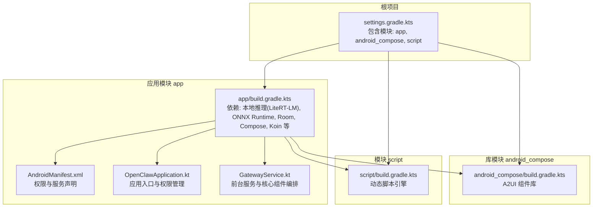
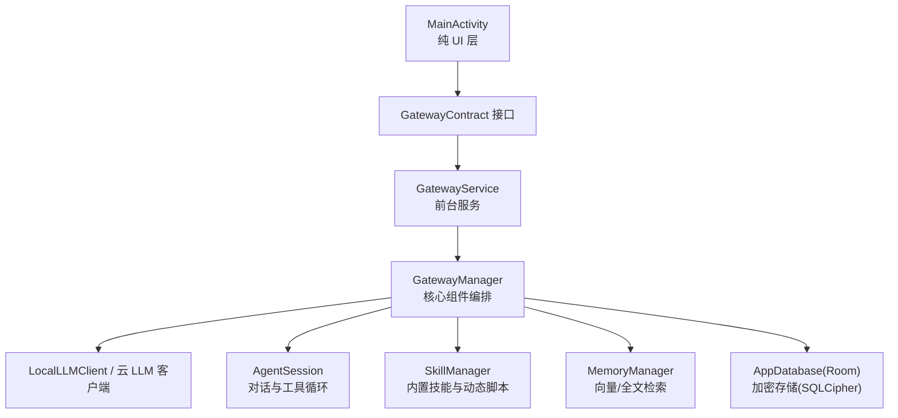
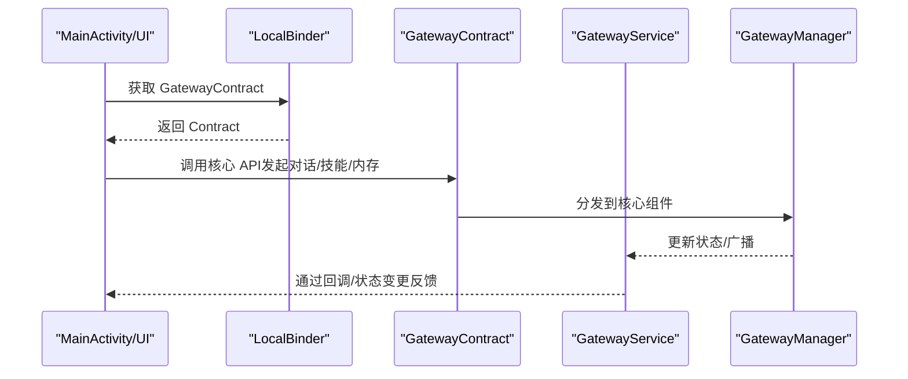
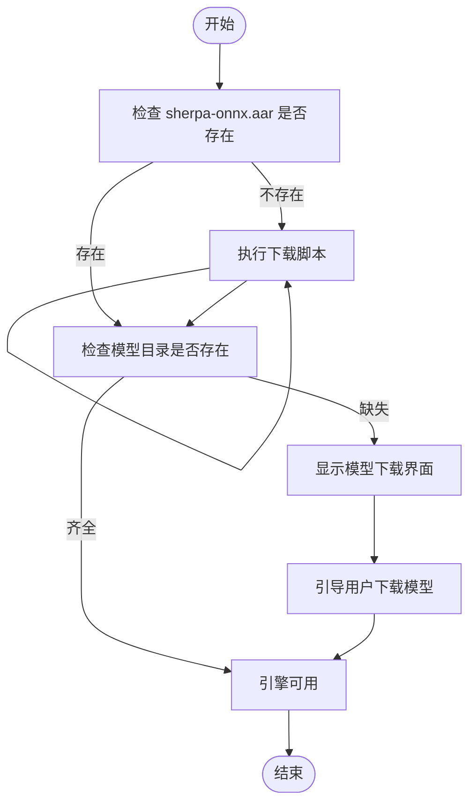
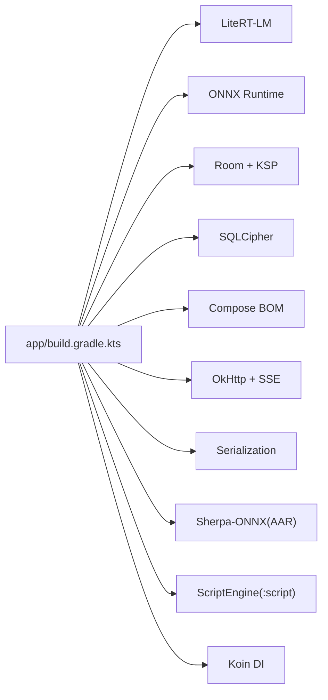

# 快速开始

<cite>
**本文引用的文件**
- [README.md](file://README.md)
- [PROJECT.md](file://PROJECT.md)
- [SHERPA_INTEGRATION.md](file://SHERPA_INTEGRATION.md)
- [build.gradle.kts](file://build.gradle.kts)
- [settings.gradle.kts](file://settings.gradle.kts)
- [gradle.properties](file://gradle.properties)
- [gradle-wrapper.properties](file://gradle-wrapper.properties)
- [app/build.gradle.kts](file://app/build.gradle.kts)
- [app/proguard-rules.pro](file://app/proguard-rules.pro)
- [app/src/main/AndroidManifest.xml](file://app/src/main/AndroidManifest.xml)
- [app/src/main/java/ai/openclaw/android/OpenClawApplication.kt](file://app/src/main/java/ai/openclaw/android/OpenClawApplication.kt)
- [app/src/main/java/ai/openclaw/android/GatewayService.kt](file://app/src/main/java/ai/openclaw/android/GatewayService.kt)
- [scripts/download-sherpa-onnx.sh](file://scripts/download-sherpa-onnx.sh)
- [scripts/auto-fix-compilation-errors.ps1](file://scripts/auto-fix-compilation-errors.ps1)
</cite>

## 目录
1. [简介](#简介)
2. [项目结构](#项目结构)
3. [核心组件](#核心组件)
4. [架构总览](#架构总览)
5. [详细组件分析](#详细组件分析)
6. [依赖分析](#依赖分析)
7. [性能考虑](#性能考虑)
8. [故障排除指南](#故障排除指南)
9. [结论](#结论)
10. [附录](#附录)

## 简介
本指南面向新加入的开发者，帮助你在最短时间内完成 OpenClaw-Android 的环境搭建、项目克隆、依赖准备、构建与运行，并掌握调试配置与常见问题排查方法。项目采用 Kotlin、Jetpack Compose、Room、SQLite（加密）、LiteRT-LM、ONNX Runtime、Sherpa-ONNX 等技术栈，支持本地与云端 LLM、技能系统、语音交互、通知智能处理与无障碍自动化。

## 项目结构
OpenClaw-Android 采用多模块结构，核心模块包括：
- app：主应用模块，包含 UI、业务逻辑、数据层、服务与集成
- android_compose：A2UI 组件库，用于富 UI 渲染
- script：动态脚本引擎模块
- docs：项目文档与设计说明
- scripts：辅助脚本（如语音模型下载）

图表来源
- [settings.gradle.kts:21-24](file://settings.gradle.kts#L21-L24)
- [app/build.gradle.kts:126-216](file://app/build.gradle.kts#L126-L216)
- [app/src/main/AndroidManifest.xml:1-123](file://app/src/main/AndroidManifest.xml#L1-L123)
- [app/src/main/java/ai/openclaw/android/OpenClawApplication.kt:1-19](file://app/src/main/java/ai/openclaw/android/OpenClawApplication.kt#L1-L19)
- [app/src/main/java/ai/openclaw/android/GatewayService.kt:1-234](file://app/src/main/java/ai/openclaw/android/GatewayService.kt#L1-L234)

章节来源
- [settings.gradle.kts:1-24](file://settings.gradle.kts#L1-L24)
- [README.md:89-152](file://README.md#L89-L152)

## 核心组件
- 应用入口与权限管理：OpenClawApplication 负责初始化权限管理器，贯穿应用生命周期
- 前台服务与核心编排：GatewayService 作为“单一真相来源”，持有并编排所有核心组件（LLM、Agent、技能、内存、数据库等），并通过 Binder 暴露 GatewayContract 接口给 UI 层
- 权限与声明：AndroidManifest.xml 声明了联网、通知、存储、相机、录音、无障碍、通知监听等权限，并注册了 GatewayService、MyAccessibilityService、SmartNotificationListener 等服务
- 语音与模型：Sherpa-ONNX 作为本地 STT/TTS 引擎，配合模型下载脚本与下载界面进行部署

章节来源
- [app/src/main/java/ai/openclaw/android/OpenClawApplication.kt:7-19](file://app/src/main/java/ai/openclaw/android/OpenClawApplication.kt#L7-L19)
- [app/src/main/java/ai/openclaw/android/GatewayService.kt:31-234](file://app/src/main/java/ai/openclaw/android/GatewayService.kt#L31-L234)
- [app/src/main/AndroidManifest.xml:51-121](file://app/src/main/AndroidManifest.xml#L51-L121)

## 架构总览
项目采用“前台服务 + Binder 接口”的 Gateway Service 架构，UI 层仅负责展示与交互，核心逻辑集中在服务中，保证模型与组件生命周期独立于 Activity，避免频繁重载与状态丢失。

图表来源
- [README.md:7-48](file://README.md#L7-L48)
- [app/src/main/java/ai/openclaw/android/GatewayService.kt:31-234](file://app/src/main/java/ai/openclaw/android/GatewayService.kt#L31-L234)

## 详细组件分析

### 组件 A：GatewayService 与 GatewayContract
GatewayService 作为唯一逻辑中心，负责：
- 初始化配置与通知通道
- 启动/停止核心组件并监控连接状态
- 通过 LocalBinder 暴露 GatewayContract 接口供 UI 调用

图表来源
- [app/src/main/java/ai/openclaw/android/GatewayService.kt:70-73](file://app/src/main/java/ai/openclaw/android/GatewayService.kt#L70-L73)
- [README.md:7-48](file://README.md#L7-L48)

章节来源
- [app/src/main/java/ai/openclaw/android/GatewayService.kt:31-234](file://app/src/main/java/ai/openclaw/android/GatewayService.kt#L31-L234)

### 组件 B：Sherpa-ONNX 语音集成
项目集成了 Sherpa-ONNX 作为本地 STT/TTS 引擎，支持中文流式识别与语音合成，并提供模型下载脚本与下载界面。

图表来源
- [SHERPA_INTEGRATION.md:34-103](file://SHERPA_INTEGRATION.md#L34-L103)
- [scripts/download-sherpa-onnx.sh:1-63](file://scripts/download-sherpa-onnx.sh#L1-L63)

章节来源
- [SHERPA_INTEGRATION.md:1-173](file://SHERPA_INTEGRATION.md#L1-L173)
- [scripts/download-sherpa-onnx.sh:1-63](file://scripts/download-sherpa-onnx.sh#L1-L63)

## 依赖分析
项目依赖主要分为以下几类：
- 本地推理：LiteRT-LM（Gemma 4 E4B）、ONNX Runtime
- 机器学习与嵌入：TensorFlow Lite、MiniLM（TFLite/ONNX）
- UI 与组合：Jetpack Compose BOM、Material3、UI 工具
- 数据与加密：Room + KSP、SQLCipher、AndroidX Security Crypto
- 网络与序列化：OkHttp、Kotlinx Serialization
- 语音：Sherpa-ONNX（AAR 依赖）
- 脚本引擎：Rhino（原型）+ ScriptEngine 模块

图表来源
- [app/build.gradle.kts:126-216](file://app/build.gradle.kts#L126-L216)

章节来源
- [app/build.gradle.kts:126-216](file://app/build.gradle.kts#L126-L216)
- [app/proguard-rules.pro:1-66](file://app/proguard-rules.pro#L1-L66)

## 性能考虑
- 本地推理：LiteRT-LM 在不同硬件上具备 NPU/GPU/CPU 加速能力，建议优先使用支持硬件加速的设备以获得更佳性能
- 语音模型：STT/TTS 模型体积较大，建议在 WiFi 环境下载，并合理管理存储空间
- 构建优化：开启并行、缓存与配置缓存，减少重复构建时间
- 资源压缩：Release 构建启用混淆与资源收缩，降低包体与运行时开销

章节来源
- [gradle.properties:8-11](file://gradle.properties#L8-L11)
- [SHERPA_INTEGRATION.md:147-151](file://SHERPA_INTEGRATION.md#L147-L151)

## 故障排除指南

### 1) 签名与调试密钥
- 开发调试使用统一的调试密钥库，确保跨平台一致性
- 若签名不一致导致安装冲突，请清理旧版本或更换签名配置

章节来源
- [app/build.gradle.kts:49-91](file://app/build.gradle.kts#L49-L91)
- [README.md:172-179](file://README.md#L172-L179)

### 2) 本地推理与模型加载
- LiteRT-LM 初始化失败通常与模型文件或页对齐有关，需确保模型路径正确且满足对齐要求
- 如遇 native 库加载失败，检查 ABI 过滤与 NDK 版本

章节来源
- [app/build.gradle.kts:36-41](file://app/build.gradle.kts#L36-L41)
- [PROJECT.md:365-376](file://PROJECT.md#L365-L376)

### 3) 语音模型缺失
- 当前仓库包含 stub AAR，功能测试需下载真实 AAR（约 56MB）
- 首次运行若检测到模型缺失，将引导进入模型下载界面；请按提示完成下载并放置到指定目录

章节来源
- [SHERPA_INTEGRATION.md:36-103](file://SHERPA_INTEGRATION.md#L36-L103)
- [scripts/download-sherpa-onnx.sh:19-63](file://scripts/download-sherpa-onnx.sh#L19-L63)

### 4) 构建失败与自动修复
- 可使用 PowerShell 脚本捕获构建错误并交由 Claude Code 分析修复建议
- 建议先执行一次完整构建，再根据日志进行针对性修复

章节来源
- [scripts/auto-fix-compilation-errors.ps1:1-27](file://scripts/auto-fix-compilation-errors.ps1#L1-L27)

### 5) 权限与服务声明
- 确认 AndroidManifest.xml 中已声明所需权限与服务
- 特别关注存储权限（尤其是 Android 11+ 的全文件访问权限）与通知监听权限

章节来源
- [app/src/main/AndroidManifest.xml:51-121](file://app/src/main/AndroidManifest.xml#L51-L121)

### 6) ProGuard/混淆
- 项目已针对 Kotlinx Serialization、LiteRT-LM、OkHttp、Room、Sherpa-ONNX 等添加保留规则
- 若出现运行时反射或库调用异常，请检查混淆规则是否覆盖相关类

章节来源
- [app/proguard-rules.pro:1-66](file://app/proguard-rules.pro#L1-L66)

## 结论
通过本快速开始指南，你已经完成了环境准备、项目克隆、依赖准备、构建与运行的基础流程，并掌握了调试配置与常见问题的排查方法。建议在本地准备好 LiteRT-LM 模型与 Sherpa-ONNX 模型后，再进行端到端的功能验证，以获得最佳开发体验。

## 附录

### 环境与工具要求
- Android SDK：35（Android 16）
- Kotlin：1.9.25
- Gradle：8.9
- Min SDK：29（Android 10）
- Target SDK：35
- Java/JBR：17 或 21（根据项目配置）

章节来源
- [README.md:154-161](file://README.md#L154-L161)
- [gradle.properties:2](file://gradle.properties#L2)

### 构建与运行命令
- Debug 构建
  - ./gradlew :app:assembleDebug
- 清理并 Debug 构建
  - ./gradlew clean :app:assembleDebug
- Release 构建
  - ./gradlew :app:assembleRelease
- 安装 Debug
  - ./gradlew installDebug
- 单元测试
  - ./gradlew test
- 连接设备仪器测试
  - ./gradlew connectedAndroidTest

章节来源
- [README.md:162-170](file://README.md#L162-L170)
- [PROJECT.md:544-572](file://PROJECT.md#L544-L572)

### 语音模型下载与部署
- 执行下载脚本以获取 sherpa-onnx AAR
  - bash scripts/download-sherpa-onnx.sh
- 首次运行时根据提示下载 STT/TTS 模型至指定目录
- 构建并安装 APK 至真机进行验证

章节来源
- [SHERPA_INTEGRATION.md:34-103](file://SHERPA_INTEGRATION.md#L34-L103)
- [scripts/download-sherpa-onnx.sh:19-63](file://scripts/download-sherpa-onnx.sh#L19-L63)

### Gradle 配置与仓库
- Gradle Wrapper 使用国内镜像源，便于网络稳定
- 顶层 build.gradle.kts 声明了 Android Gradle Plugin、Kotlin 插件、Compose 插件与 KSP 插件
- settings.gradle.kts 配置了仓库优先级与模块包含关系

章节来源
- [gradle-wrapper.properties:1-5](file://gradle-wrapper.properties#L1-L5)
- [build.gradle.kts:1-9](file://build.gradle.kts#L1-L9)
- [settings.gradle.kts:1-24](file://settings.gradle.kts#L1-L24)