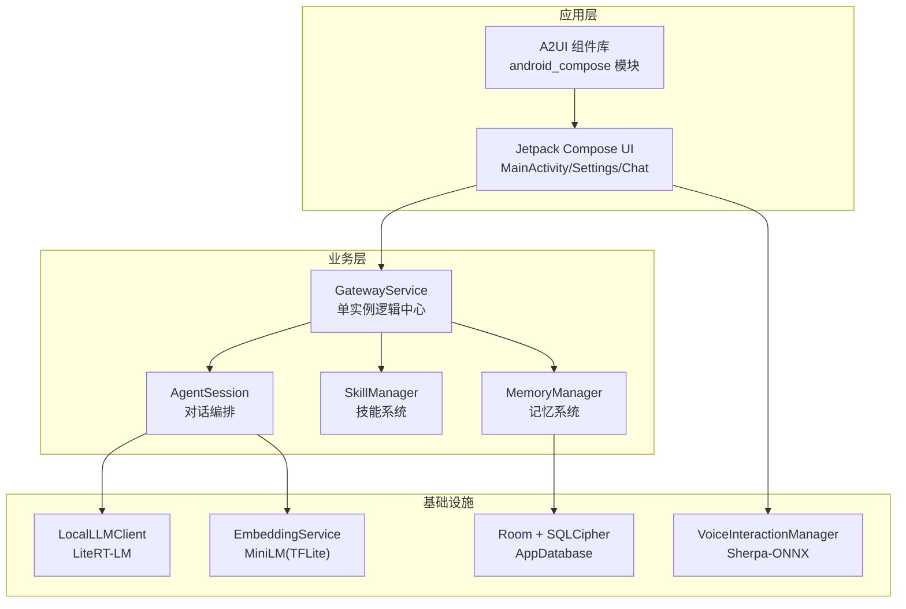
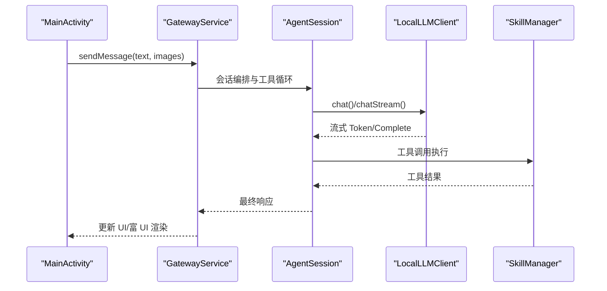
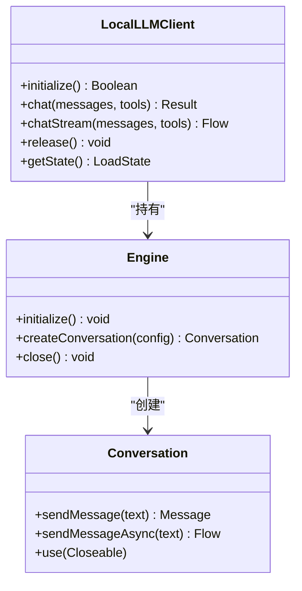
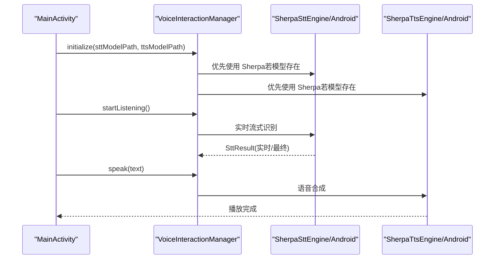
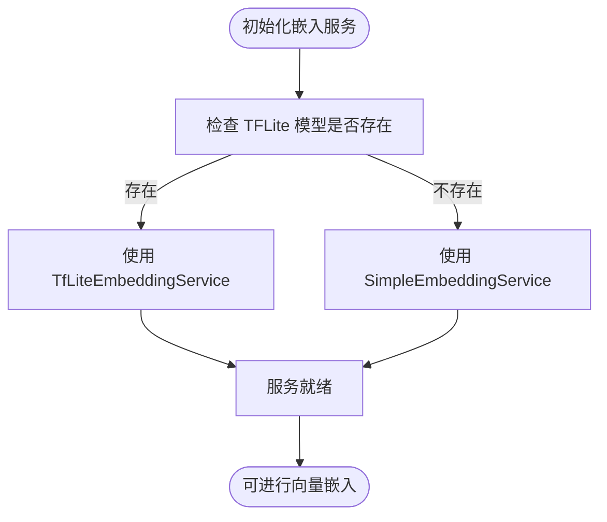
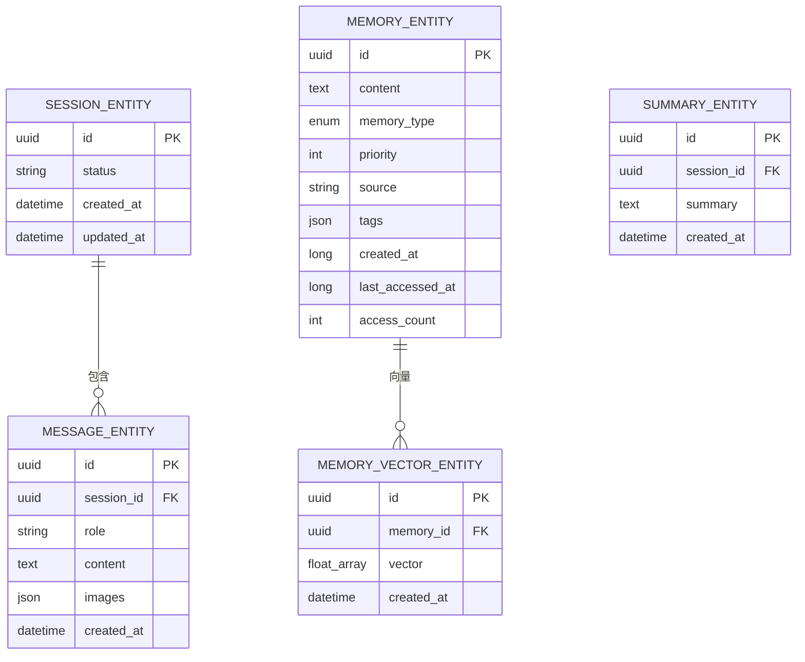
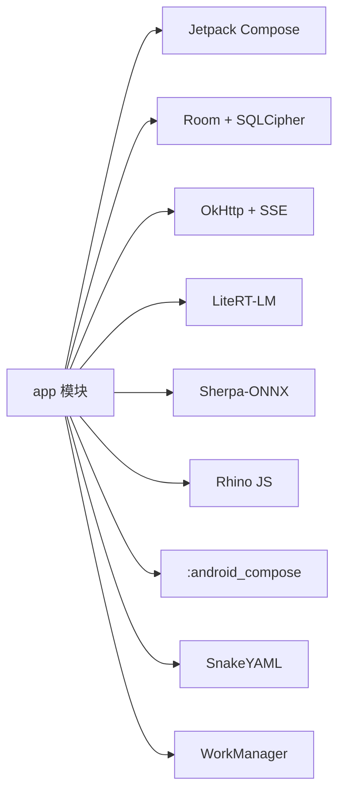

# 技术栈

<cite>
**本文引用的文件**
- [build.gradle.kts](file://build.gradle.kts)
- [app/build.gradle.kts](file://app/build.gradle.kts)
- [gradle.properties](file://gradle.properties)
- [settings.gradle.kts](file://settings.gradle.kts)
- [README.md](file://README.md)
- [PROJECT.md](file://PROJECT.md)
- [SHERPA_INTEGRATION.md](file://SHERPA_INTEGRATION.md)
- [LocalLLMClient.kt](file://app/src/main/java/ai/openclaw/android/model/LocalLLMClient.kt)
- [SherpaSttEngine.kt](file://app/src/main/java/ai/openclaw/android/voice/stt/SherpaSttEngine.kt)
- [SherpaTtsEngine.kt](file://app/src/main/java/ai/openclaw/android/voice/tts/SherpaTtsEngine.kt)
- [VoiceInteractionManager.kt](file://app/src/main/java/ai/openclaw/android/voice/VoiceInteractionManager.kt)
- [TfLiteEmbeddingService.kt](file://app/src/main/java/ai/openclaw/android/ml/TfLiteEmbeddingService.kt)
- [EmbeddingServiceFactory.kt](file://app/src/main/java/ai/openclaw/android/ml/EmbeddingServiceFactory.kt)
- [AppDatabase.kt](file://app/src/main/java/ai/openclaw/android/data/local/AppDatabase.kt)
- [Theme.kt](file://app/src/main/java/ai/openclaw/android/ui/theme/Theme.kt)
- [MainActivity.kt](file://app/src/main/java/ai/openclaw/android/MainActivity.kt)
</cite>

## 目录
1. [简介](#简介)
2. [项目结构](#项目结构)
3. [核心组件](#核心组件)
4. [架构总览](#架构总览)
5. [详细组件分析](#详细组件分析)
6. [依赖分析](#依赖分析)
7. [性能考虑](#性能考虑)
8. [故障排查指南](#故障排查指南)
9. [结论](#结论)
10. [附录](#附录)

## 简介
本项目采用现代 Android 技术栈，围绕“本地推理 + 语音交互 + 持久记忆 + 技能系统”的核心目标进行构建。技术选型强调：
- 本地推理：LiteRT-LM 提供 Gemma 4 E4B 的高性能端侧推理，支持 GPU/NPU/CPU 加速。
- 语音交互：Sherpa-ONNX 替代系统语音组件，实现离线 STT/TTS，覆盖无 GMS 设备。
- 数据与安全：Room + SQLCipher 加密数据库，配合 AndroidX Security Crypto 保护敏感配置。
- 界面与交互：Jetpack Compose + Material3，提供现代化、可定制的主题与组件体系。

## 项目结构
项目采用多模块结构，核心模块包括：
- app：主应用模块，包含 UI、业务逻辑、语音、数据库、模型客户端等。
- android_compose：自研 A2UI 组件库，提供富 UI 渲染能力。
- script：脚本引擎模块，用于动态脚本执行与桥接。

图表来源
- [MainActivity.kt](file://app/src/main/java/ai/openclaw/android/MainActivity.kt)
- [AppDatabase.kt](file://app/src/main/java/ai/openclaw/android/data/local/AppDatabase.kt)
- [LocalLLMClient.kt](file://app/src/main/java/ai/openclaw/android/model/LocalLLMClient.kt)
- [VoiceInteractionManager.kt](file://app/src/main/java/ai/openclaw/android/voice/VoiceInteractionManager.kt)
- [TfLiteEmbeddingService.kt](file://app/src/main/java/ai/openclaw/android/ml/TfLiteEmbeddingService.kt)

章节来源
- [README.md](file://README.md)
- [settings.gradle.kts](file://settings.gradle.kts)

## 核心组件
- Android SDK 与构建工具
  - compileSdk/targetSdk/minSdk：36/35/29
  - Kotlin：2.3.0（JVM 17）
  - Android Gradle Plugin：8.7.3
  - NDK：27.0.12077973（仅保留 arm64-v8a）
- UI 框架：Jetpack Compose + Material3（BOM 2025.03.00）
- 网络：OkHttp + OkHttp-SSE
- 序列化：Kotlinx Serialization 1.8.0
- 数据库：Room 2.7.2 + KSP + SQLCipher 4.10.0
- 本地推理：LiteRT-LM 0.10.0（Gemma 4 E4B）
- 机器学习：TensorFlow Lite（MiniLM 384维嵌入）
- 语音：Sherpa-ONNX（STT/TTS）
- 安全：AndroidX Security Crypto + Android Keystore
- 协程：kotlinx-coroutines-android 1.10.1
- 依赖注入：Koin（手动注入）

章节来源
- [app/build.gradle.kts](file://app/build.gradle.kts)
- [gradle.properties](file://gradle.properties)
- [PROJECT.md](file://PROJECT.md)

## 架构总览
应用采用“单源真相”架构，GatewayService 作为唯一逻辑中心，持有模型、会话、技能、记忆等核心组件，Activity 仅为纯 UI 层，通过 Binder 接口与服务交互。该设计避免 Activity 销毁导致的模型重载，显著降低冷启动成本。

图表来源
- [README.md](file://README.md)
- [MainActivity.kt](file://app/src/main/java/ai/openclaw/android/MainActivity.kt)
- [LocalLLMClient.kt](file://app/src/main/java/ai/openclaw/android/model/LocalLLMClient.kt)

## 详细组件分析

### 本地推理引擎：LiteRT-LM
- 能力概述
  - 支持 Gemma 4 E4B（4B 参数，约 3.5GB），提供 ~18 tok/s（CPU）/ ~22 tok/s（GPU）性能。
  - 自动选择后端：NPU → GPU → CPU，针对 Honor/Huawei 做了兼容性处理。
  - 支持工具调用桥接，将模型内部工具调用转发至技能系统。
- 关键特性
  - 多后端初始化与超时控制
  - GPU 初始化失败的自动重试与崩溃计数
  - 会话级互斥锁与流式响应
  - 视觉输入降级：图片描述拼接到文本
- 适配与优化
  - 针对不同芯片平台的后端优先级
  - 会话消息截断与令牌预算控制
  - 模型文件搜索顺序（应用私有存储优先）

图表来源
- [LocalLLMClient.kt](file://app/src/main/java/ai/openclaw/android/model/LocalLLMClient.kt)

章节来源
- [LocalLLMClient.kt](file://app/src/main/java/ai/openclaw/android/model/LocalLLMClient.kt)
- [PROJECT.md](file://PROJECT.md)

### 语音引擎：Sherpa-ONNX 集成
- 能力概述
  - STT：支持 Zipformer（轻量中文流式）与 Streaming Paraformer（中英双语）。
  - TTS：支持 VITS/Melo TTS 模型。
  - 支持模型下载管理与 Compose 下载界面。
- 架构设计
  - VoiceInteractionManager 统一入口，自动选择 Sherpa 或 Android 引擎。
  - 支持运行时切换引擎与语音状态管理。
- 已知限制
  - 当前仓库包含 stub AAR，功能测试需下载真实 AAR。
  - 模型文件较大，建议在 WiFi 环境下载。

图表来源
- [VoiceInteractionManager.kt](file://app/src/main/java/ai/openclaw/android/voice/VoiceInteractionManager.kt)
- [SherpaSttEngine.kt](file://app/src/main/java/ai/openclaw/android/voice/stt/SherpaSttEngine.kt)
- [SherpaTtsEngine.kt](file://app/src/main/java/ai/openclaw/android/voice/tts/SherpaTtsEngine.kt)
- [SHERPA_INTEGRATION.md](file://SHERPA_INTEGRATION.md)

章节来源
- [VoiceInteractionManager.kt](file://app/src/main/java/ai/openclaw/android/voice/VoiceInteractionManager.kt)
- [SHERPA_INTEGRATION.md](file://SHERPA_INTEGRATION.md)

### 记忆与嵌入：MiniLM 嵌入服务
- 能力概述
  - 使用 MiniLM-L6-v2（384 维）进行句子嵌入，支持 TF Lite 与简单哈希降级方案。
  - 嵌入服务工厂根据资源可用性自动选择实现。
- 性能与可靠性
  - 令牌预算与消息截断，避免超出模型上下文。
  - LruCache 缓存与去重、冲突检测，减少无效存储。

图表来源
- [EmbeddingServiceFactory.kt](file://app/src/main/java/ai/openclaw/android/ml/EmbeddingServiceFactory.kt)
- [TfLiteEmbeddingService.kt](file://app/src/main/java/ai/openclaw/android/ml/TfLiteEmbeddingService.kt)

章节来源
- [EmbeddingServiceFactory.kt](file://app/src/main/java/ai/openclaw/android/ml/EmbeddingServiceFactory.kt)
- [TfLiteEmbeddingService.kt](file://app/src/main/java/ai/openclaw/android/ml/TfLiteEmbeddingService.kt)

### 数据层：Room + SQLCipher
- 能力概述
  - Room 数据库 + SQLCipher 加密，支持迁移与 FTS 虚拟表。
  - 安全密钥来自 Android Keystore，数据库口令动态生成。
- 关键实体与 DAO
  - 会话、消息、摘要、记忆、动态技能、触发规则与日志等。
- 运行时特性
  - 打开数据库时创建 FTS 虚拟表，支持全文检索。

图表来源
- [AppDatabase.kt](file://app/src/main/java/ai/openclaw/android/data/local/AppDatabase.kt)

章节来源
- [AppDatabase.kt](file://app/src/main/java/ai/openclaw/android/data/local/AppDatabase.kt)

### UI 主题与界面
- 主题设计
  - 采用深色科幻主题（深海蓝 + 青色霓虹），支持亮色模式与旧版 Material 主题切换。
  - 通过 OpenClawTheme 应用颜色方案与状态栏样式。
- 界面组织
  - MainActivity 作为单一入口，底部导航切换聊天、通知、设置。
  - 顶部应用栏、权限请求、屏幕截图授权、音量键语音输入等。

章节来源
- [Theme.kt](file://app/src/main/java/ai/openclaw/android/ui/theme/Theme.kt)
- [MainActivity.kt](file://app/src/main/java/ai/openclaw/android/MainActivity.kt)

## 依赖分析
- 构建与插件
  - AGP 8.7.3、Kotlin 2.3.0、Compose 插件、KSP。
- 运行时依赖
  - Jetpack Compose 生态、OkHttp、Room、SQLCipher、LiteRT-LM、Sherpa-ONNX、Rhino JS 引擎、A2UI 组件库、SnakeYAML、WorkManager 等。
- 依赖关系示意

图表来源
- [app/build.gradle.kts](file://app/build.gradle.kts)

章节来源
- [app/build.gradle.kts](file://app/build.gradle.kts)

## 性能考虑
- 本地推理
  - 后端优先级与超时控制，GPU 失败自动降级 CPU，避免阻塞。
  - 会话互斥与流式响应，减少重复计算与内存占用。
- 语音交互
  - 流式识别与实时转写，降低端到端延迟。
  - 模型文件缓存与懒加载，避免重复初始化。
- 数据与检索
  - 向量嵌入缓存与去重，减少重复向量存储。
  - BM25 + 向量 + 时间衰减融合检索，兼顾准确率与效率。
- UI 与资源
  - Compose 原生渲染，Material3 主题减少过度绘制。
  - Debug 与 Release 构建差异，Release 启用混淆与资源压缩。

## 故障排查指南
- 本地模型无法加载
  - 确认模型文件存在于应用私有存储或 /sdcard/Download，并符合命名规范。
  - 检查 GPU 初始化失败记录，必要时重置 GPU 标记。
- 语音引擎不可用
  - 确认模型目录存在且具备 MANAGE_EXTERNAL_STORAGE 权限。
  - 若 Sherpa 引擎不可用，系统会回退到 Android 原生引擎。
- 数据库异常
  - 确认数据库口令来自安全密钥，检查迁移脚本与 FTS 表创建。
- 依赖与构建
  - 检查 Gradle 配置与仓库镜像，确保 Kotlin/AGP/Compose 插件版本匹配。

章节来源
- [LocalLLMClient.kt](file://app/src/main/java/ai/openclaw/android/model/LocalLLMClient.kt)
- [VoiceInteractionManager.kt](file://app/src/main/java/ai/openclaw/android/voice/VoiceInteractionManager.kt)
- [AppDatabase.kt](file://app/src/main/java/ai/openclaw/android/data/local/AppDatabase.kt)
- [app/build.gradle.kts](file://app/build.gradle.kts)

## 结论
本项目以“本地推理 + 语音 + 记忆 + 技能”为核心，结合 Jetpack Compose 与现代 Android 技术栈，实现了高隐私、低延迟、可扩展的智能体平台。LiteRT-LM 与 Sherpa-ONNX 的引入，使应用在离线场景下仍具备强大的自然语言与语音能力；Room + SQLCipher 的数据层设计，确保了用户数据的安全与持久化。整体架构清晰、模块边界明确，便于后续扩展与维护。

## 附录

### 技术兼容性与最低要求
- Android SDK
  - compileSdk：36
  - targetSdk：35
  - minSdk：29（Android 10）
- 构建工具
  - Android Gradle Plugin：8.7.3
  - Kotlin：2.3.0（JVM 17）
  - NDK：27.0.12077973（仅 arm64-v8a）
- 第三方库版本（节选）
  - Jetpack Compose BOM：2025.03.00
  - Room：2.7.2
  - SQLCipher：4.10.0
  - LiteRT-LM：0.10.0
  - OkHttp：4.12.0
  - Sherpa-ONNX：AAR（需自行下载）
  - Rhino JS：1.7.15

章节来源
- [app/build.gradle.kts](file://app/build.gradle.kts)
- [gradle.properties](file://gradle.properties)
- [README.md](file://README.md)
- [PROJECT.md](file://PROJECT.md)