# 架构概览

<cite>
**本文引用的文件**
- [GatewayService.kt](file://app/src/main/java/ai/openclaw/android/GatewayService.kt)
- [GatewayManager.kt](file://app/src/main/java/ai/openclaw/android/GatewayManager.kt)
- [GatewayContract.kt](file://app/src/main/java/ai/openclaw/android/GatewayContract.kt)
- [AgentSession.kt](file://app/src/main/java/ai/openclaw/android/agent/AgentSession.kt)
- [SkillManager.kt](file://app/src/main/java/ai/openclaw/android/skill/SkillManager.kt)
- [MemoryManager.kt](file://app/src/main/java/ai/openclaw/android/domain/memory/MemoryManager.kt)
- [HybridSessionManager.kt](file://app/src/main/java/ai/openclaw/android/domain/session/HybridSessionManager.kt)
- [AgentSessionManager.kt](file://app/src/main/java/ai/openclaw/android/domain/agent/AgentSessionManager.kt)
- [MainActivity.kt](file://app/src/main/java/ai/openclaw/android/MainActivity.kt)
- [ConfigManager.kt](file://app/src/main/java/ai/openclaw/android/ConfigManager.kt)
- [ModelClient.kt](file://app/src/main/java/ai/openclaw/android/model/ModelClient.kt)
- [DynamicSkillManager.kt](file://app/src/main/java/ai/openclaw/android/skill/DynamicSkillManager.kt)
- [AppDatabase.kt](file://app/src/main/java/ai/openclaw/android/data/local/AppDatabase.kt)
- [HybridSearchEngine.kt](file://app/src/main/java/ai/openclaw/android/domain/memory/HybridSearchEngine.kt)
</cite>

## 目录
1. [引言](#引言)
2. [项目结构](#项目结构)
3. [核心组件](#核心组件)
4. [架构总览](#架构总览)
5. [详细组件分析](#详细组件分析)
6. [依赖分析](#依赖分析)
7. [性能考虑](#性能考虑)
8. [故障排查指南](#故障排查指南)
9. [结论](#结论)

## 引言
本文件面向OpenClaw-Android项目的开发者，系统性阐述“Gateway Service Pattern”的设计理念与实现原理，解释“单一真实来源”（Single Source of Truth, SST）架构的优势与设计考量，并深入剖析Activity与Service的职责分离、前台服务的必要性与收益。文档还详细说明核心组件之间的关系与数据流，包括AgentSession、SkillManager、MemoryManager等关键模块如何协同工作，最后提供清晰的架构图与交互流程图，帮助读者快速理解系统的整体设计思路。

## 项目结构
OpenClaw-Android采用以功能域为中心的分层组织方式：
- 应用入口与界面层：MainActivity负责UI与用户交互，通过绑定GatewayService获取统一的GatewayContract接口。
- 服务层：GatewayService作为前台服务承载核心业务，GatewayManager作为其内部管理器，封装多子系统初始化、生命周期与对外契约。
- 领域层：AgentSession负责对话与工具调用；SkillManager管理内置与动态技能；MemoryManager与HybridSessionManager负责记忆与会话持久化。
- 数据层：AppDatabase通过Room管理本地数据库，配合DAO层进行数据读写；HybridSearchEngine融合BM25与向量检索。
- 配置与契约：ConfigManager集中管理配置；GatewayContract定义Activity与Service之间的稳定接口。

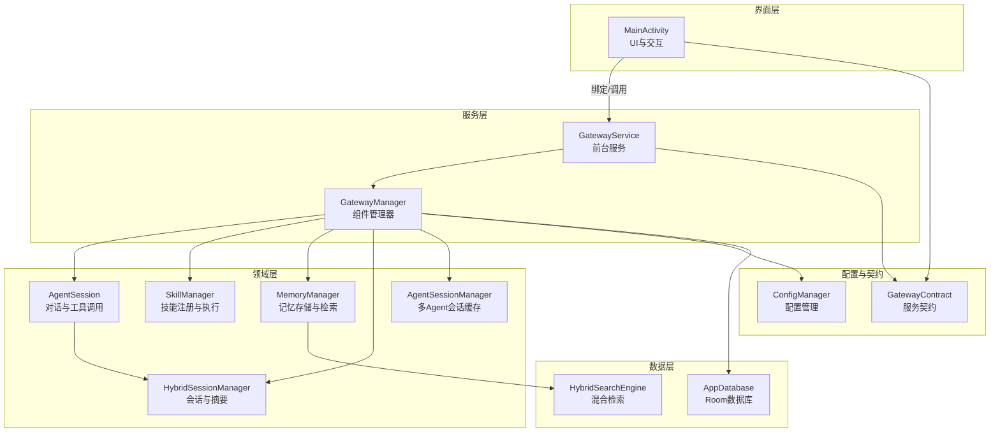

图表来源
- [MainActivity.kt:107-131](file://app/src/main/java/ai/openclaw/android/MainActivity.kt#L107-L131)
- [GatewayService.kt:31-120](file://app/src/main/java/ai/openclaw/android/GatewayService.kt#L31-L120)
- [GatewayManager.kt:65-110](file://app/src/main/java/ai/openclaw/android/GatewayManager.kt#L65-L110)
- [AgentSession.kt:35-40](file://app/src/main/java/ai/openclaw/android/agent/AgentSession.kt#L35-L40)
- [SkillManager.kt:8-33](file://app/src/main/java/ai/openclaw/android/skill/SkillManager.kt#L8-L33)
- [MemoryManager.kt:10-15](file://app/src/main/java/ai/openclaw/android/domain/memory/MemoryManager.kt#L10-L15)
- [HybridSessionManager.kt:31-38](file://app/src/main/java/ai/openclaw/android/domain/session/HybridSessionManager.kt#L31-L38)
- [AgentSessionManager.kt:32-40](file://app/src/main/java/ai/openclaw/android/domain/agent/AgentSessionManager.kt#L32-L40)
- [AppDatabase.kt:25-41](file://app/src/main/java/ai/openclaw/android/data/local/AppDatabase.kt#L25-L41)
- [HybridSearchEngine.kt:18-23](file://app/src/main/java/ai/openclaw/android/domain/memory/HybridSearchEngine.kt#L18-L23)
- [ConfigManager.kt:11-52](file://app/src/main/java/ai/openclaw/android/ConfigManager.kt#L11-L52)
- [GatewayContract.kt:15-34](file://app/src/main/java/ai/openclaw/android/GatewayContract.kt#L15-L34)

章节来源
- [MainActivity.kt:107-141](file://app/src/main/java/ai/openclaw/android/MainActivity.kt#L107-L141)
- [GatewayService.kt:31-120](file://app/src/main/java/ai/openclaw/android/GatewayService.kt#L31-L120)
- [GatewayManager.kt:65-110](file://app/src/main/java/ai/openclaw/android/GatewayManager.kt#L65-L110)

## 核心组件
- GatewayService：前台服务，负责生命周期管理、通知展示、广播状态变更、绑定暴露契约。
- GatewayManager：服务内部的“单一真实来源”，负责组件初始化、状态管理、对外契约实现。
- GatewayContract：Activity只依赖的稳定接口，屏蔽内部实现细节，便于未来跨进程扩展。
- AgentSession：单轮/流式对话、工具调用、反射优化、历史与令牌控制。
- SkillManager：内置技能注册与执行、权限校验、工具定义聚合。
- MemoryManager：记忆存储、向量嵌入、检索、清理策略。
- HybridSessionManager：会话持久化、摘要生成、记忆注入、压缩与跨会话关联。
- AgentSessionManager：多Agent会话缓存与LRU淘汰、共享本地模型客户端。
- AppDatabase：Room数据库，加密存储，迁移与FTS索引。
- HybridSearchEngine：BM25关键词检索与向量相似度融合，带时间衰减与缓存。
- ConfigManager：配置集中管理，含加密密钥存储。
- ModelClient：模型调用抽象，支持同步与流式响应。

章节来源
- [GatewayService.kt:31-120](file://app/src/main/java/ai/openclaw/android/GatewayService.kt#L31-L120)
- [GatewayManager.kt:65-110](file://app/src/main/java/ai/openclaw/android/GatewayManager.kt#L65-L110)
- [GatewayContract.kt:15-34](file://app/src/main/java/ai/openclaw/android/GatewayContract.kt#L15-L34)
- [AgentSession.kt:35-40](file://app/src/main/java/ai/openclaw/android/agent/AgentSession.kt#L35-L40)
- [SkillManager.kt:8-33](file://app/src/main/java/ai/openclaw/android/skill/SkillManager.kt#L8-L33)
- [MemoryManager.kt:10-15](file://app/src/main/java/ai/openclaw/android/domain/memory/MemoryManager.kt#L10-L15)
- [HybridSessionManager.kt:31-38](file://app/src/main/java/ai/openclaw/android/domain/session/HybridSessionManager.kt#L31-L38)
- [AgentSessionManager.kt:32-40](file://app/src/main/java/ai/openclaw/android/domain/agent/AgentSessionManager.kt#L32-L40)
- [AppDatabase.kt:25-41](file://app/src/main/java/ai/openclaw/android/data/local/AppDatabase.kt#L25-L41)
- [HybridSearchEngine.kt:18-23](file://app/src/main/java/ai/openclaw/android/domain/memory/HybridSearchEngine.kt#L18-L23)
- [ConfigManager.kt:11-52](file://app/src/main/java/ai/openclaw/android/ConfigManager.kt#L11-L52)
- [ModelClient.kt:10-32](file://app/src/main/java/ai/openclaw/android/model/ModelClient.kt#L10-L32)

## 架构总览
Gateway Service Pattern以“前台服务 + 统一契约 + 单一真实来源”的方式实现：
- Activity仅通过GatewayContract与服务交互，不直接依赖内部组件，降低耦合与测试难度。
- GatewayService负责生命周期与前台通知，GatewayManager作为SST，集中初始化与调度各子系统。
- “单一真实来源”体现在：配置、会话、记忆、技能、模型客户端均由GatewayManager统一管理，避免分散状态导致的竞态与不一致。
- 前台服务确保在后台也能稳定运行，提升用户体验与系统稳定性。

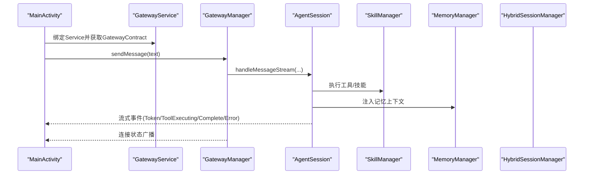

图表来源
- [MainActivity.kt:107-131](file://app/src/main/java/ai/openclaw/android/MainActivity.kt#L107-L131)
- [GatewayService.kt:109-120](file://app/src/main/java/ai/openclaw/android/GatewayService.kt#L109-L120)
- [GatewayManager.kt:116-128](file://app/src/main/java/ai/openclaw/android/GatewayManager.kt#L116-L128)
- [AgentSession.kt:451-556](file://app/src/main/java/ai/openclaw/android/agent/AgentSession.kt#L451-L556)
- [SkillManager.kt:62-83](file://app/src/main/java/ai/openclaw/android/skill/SkillManager.kt#L62-L83)
- [MemoryManager.kt:16-36](file://app/src/main/java/ai/openclaw/android/domain/memory/MemoryManager.kt#L16-L36)
- [HybridSessionManager.kt:154-202](file://app/src/main/java/ai/openclaw/android/domain/session/HybridSessionManager.kt#L154-L202)

## 详细组件分析

### Gateway Service 与契约
- 前台服务：创建通知通道、启动前台、状态广播、生命周期管理。
- 绑定暴露：LocalBinder提供对GatewayService与GatewayContract的访问。
- 契约接口：GatewayContract定义Activity可见的最小API集合，保证解耦与可替换性。

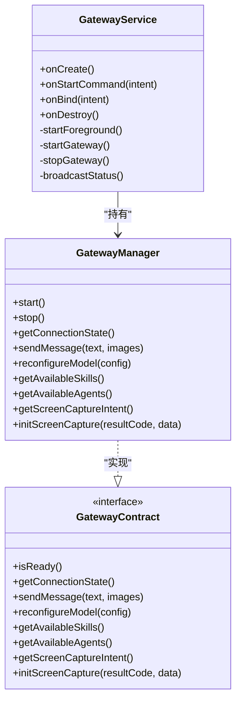

图表来源
- [GatewayService.kt:31-120](file://app/src/main/java/ai/openclaw/android/GatewayService.kt#L31-L120)
- [GatewayManager.kt:65-110](file://app/src/main/java/ai/openclaw/android/GatewayManager.kt#L65-L110)
- [GatewayContract.kt:15-34](file://app/src/main/java/ai/openclaw/android/GatewayContract.kt#L15-L34)

章节来源
- [GatewayService.kt:31-120](file://app/src/main/java/ai/openclaw/android/GatewayService.kt#L31-L120)
- [GatewayManager.kt:326-383](file://app/src/main/java/ai/openclaw/android/GatewayManager.kt#L326-L383)
- [GatewayContract.kt:15-34](file://app/src/main/java/ai/openclaw/android/GatewayContract.kt#L15-L34)

### Activity 与 Service 的职责分离
- Activity职责：UI渲染、用户交互、权限申请、语音输入、屏幕截图、配置修改、订阅服务状态。
- Service职责：后台运行、模型加载、技能与记忆初始化、会话管理、事件广播、通知更新。
- 解耦方式：通过GatewayContract与Service解耦，Activity不关心具体实现，便于单元测试与替换。

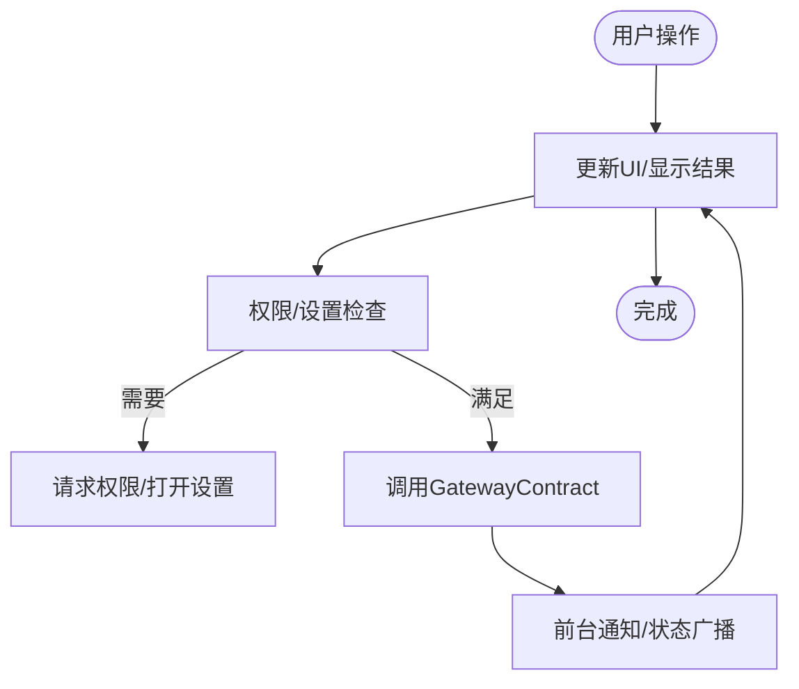

图表来源
- [MainActivity.kt:378-455](file://app/src/main/java/ai/openclaw/android/MainActivity.kt#L378-L455)
- [GatewayService.kt:221-233](file://app/src/main/java/ai/openclaw/android/GatewayService.kt#L221-L233)

章节来源
- [MainActivity.kt:378-455](file://app/src/main/java/ai/openclaw/android/MainActivity.kt#L378-L455)
- [GatewayService.kt:221-233](file://app/src/main/java/ai/openclaw/android/GatewayService.kt#L221-L233)

### AgentSession：对话与工具调用
- 支持同步与流式两种模式；基于原生函数调用而非文本解析，减少误差。
- 工具过滤与权限校验；反射优化（多轮自我改进）；历史与令牌估算裁剪。
- 与MemoryManager/HybridSessionManager集成，注入记忆上下文与会话摘要。

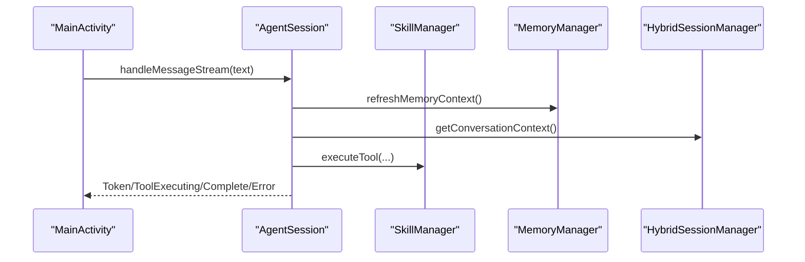

图表来源
- [AgentSession.kt:451-556](file://app/src/main/java/ai/openclaw/android/agent/AgentSession.kt#L451-L556)
- [SkillManager.kt:62-83](file://app/src/main/java/ai/openclaw/android/skill/SkillManager.kt#L62-L83)
- [MemoryManager.kt:38-61](file://app/src/main/java/ai/openclaw/android/domain/memory/MemoryManager.kt#L38-L61)
- [HybridSessionManager.kt:154-202](file://app/src/main/java/ai/openclaw/android/domain/session/HybridSessionManager.kt#L154-L202)

章节来源
- [AgentSession.kt:35-40](file://app/src/main/java/ai/openclaw/android/agent/AgentSession.kt#L35-L40)
- [AgentSession.kt:451-556](file://app/src/main/java/ai/openclaw/android/agent/AgentSession.kt#L451-L556)
- [SkillManager.kt:62-83](file://app/src/main/java/ai/openclaw/android/skill/SkillManager.kt#L62-L83)
- [MemoryManager.kt:38-61](file://app/src/main/java/ai/openclaw/android/domain/memory/MemoryManager.kt#L38-L61)
- [HybridSessionManager.kt:154-202](file://app/src/main/java/ai/openclaw/android/domain/session/HybridSessionManager.kt#L154-L202)

### MemoryManager 与 HybridSearchEngine：记忆与检索
- MemoryManager：存储记忆、生成向量、暴力相似度检索、类型与重要性查询、清理策略。
- HybridSearchEngine：BM25关键词检索 + 向量相似度 + 时间衰减融合，支持并发与缓存，提供评分明细。

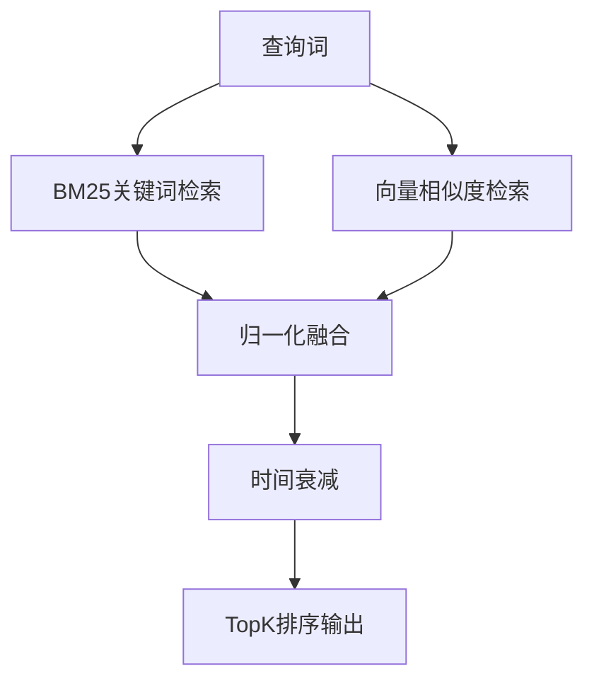

图表来源
- [HybridSearchEngine.kt:82-135](file://app/src/main/java/ai/openclaw/android/domain/memory/HybridSearchEngine.kt#L82-L135)
- [HybridSearchEngine.kt:172-185](file://app/src/main/java/ai/openclaw/android/domain/memory/HybridSearchEngine.kt#L172-L185)
- [MemoryManager.kt:38-61](file://app/src/main/java/ai/openclaw/android/domain/memory/MemoryManager.kt#L38-L61)

章节来源
- [MemoryManager.kt:10-15](file://app/src/main/java/ai/openclaw/android/domain/memory/MemoryManager.kt#L10-L15)
- [HybridSearchEngine.kt:18-23](file://app/src/main/java/ai/openclaw/android/domain/memory/HybridSearchEngine.kt#L18-L23)
- [HybridSearchEngine.kt:82-135](file://app/src/main/java/ai/openclaw/android/domain/memory/HybridSearchEngine.kt#L82-L135)

### HybridSessionManager：会话与摘要
- 会话持久化：消息插入、令牌统计、会话切换与结束。
- 摘要生成：增量压缩、跨会话记忆关联、摘要缓存与LRU。
- 记忆注入：将重要记忆注入系统提示，增强上下文。

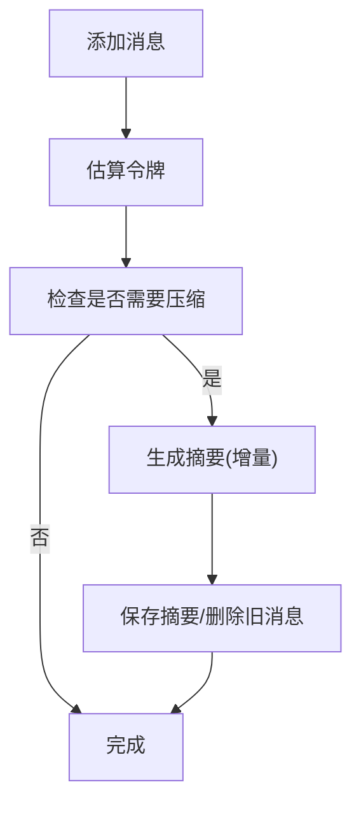

图表来源
- [HybridSessionManager.kt:69-110](file://app/src/main/java/ai/openclaw/android/domain/session/HybridSessionManager.kt#L69-L110)
- [HybridSessionManager.kt:236-299](file://app/src/main/java/ai/openclaw/android/domain/session/HybridSessionManager.kt#L236-L299)
- [HybridSessionManager.kt:154-202](file://app/src/main/java/ai/openclaw/android/domain/session/HybridSessionManager.kt#L154-L202)

章节来源
- [HybridSessionManager.kt:31-38](file://app/src/main/java/ai/openclaw/android/domain/session/HybridSessionManager.kt#L31-L38)
- [HybridSessionManager.kt:69-110](file://app/src/main/java/ai/openclaw/android/domain/session/HybridSessionManager.kt#L69-L110)
- [HybridSessionManager.kt:236-299](file://app/src/main/java/ai/openclaw/android/domain/session/HybridSessionManager.kt#L236-L299)

### AgentSessionManager：多Agent会话缓存
- LRU缓存：按访问顺序淘汰，支持最大缓存数量配置。
- 模型客户端复用：当用户选择本地模型时，多Agent共享同一LocalLLMClient实例。
- 工具初始化：为每个Agent注入可访问工具与技能工具集。

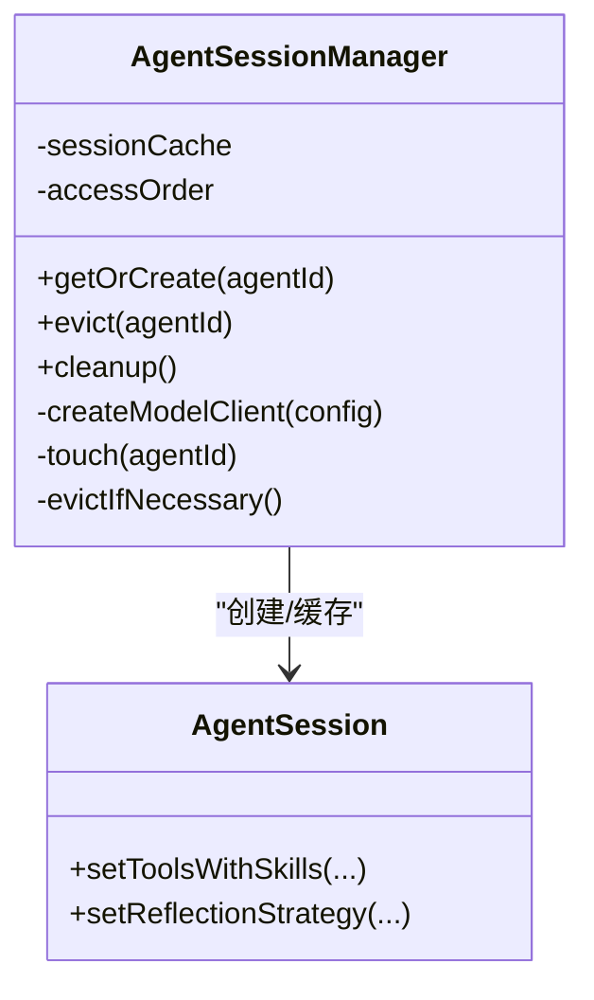

图表来源
- [AgentSessionManager.kt:32-40](file://app/src/main/java/ai/openclaw/android/domain/agent/AgentSessionManager.kt#L32-L40)
- [AgentSessionManager.kt:72-113](file://app/src/main/java/ai/openclaw/android/domain/agent/AgentSessionManager.kt#L72-L113)
- [AgentSessionManager.kt:142-175](file://app/src/main/java/ai/openclaw/android/domain/agent/AgentSessionManager.kt#L142-L175)

章节来源
- [AgentSessionManager.kt:32-40](file://app/src/main/java/ai/openclaw/android/domain/agent/AgentSessionManager.kt#L32-L40)
- [AgentSessionManager.kt:72-113](file://app/src/main/java/ai/openclaw/android/domain/agent/AgentSessionManager.kt#L72-L113)

### SkillManager 与 DynamicSkillManager：技能体系
- SkillManager：内置技能注册、工具聚合、权限校验、执行入口。
- DynamicSkillManager：动态技能JSON注册、持久化、启用/停用/删除、定时维护、工具变更通知。

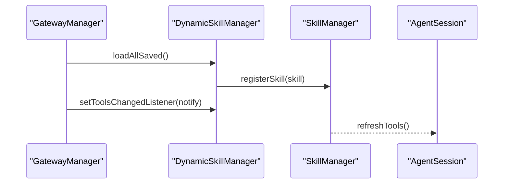

图表来源
- [GatewayManager.kt:446-474](file://app/src/main/java/ai/openclaw/android/GatewayManager.kt#L446-L474)
- [DynamicSkillManager.kt:101-116](file://app/src/main/java/ai/openclaw/android/skill/DynamicSkillManager.kt#L101-L116)
- [DynamicSkillManager.kt:41-47](file://app/src/main/java/ai/openclaw/android/skill/DynamicSkillManager.kt#L41-L47)
- [AgentSession.kt:334-362](file://app/src/main/java/ai/openclaw/android/agent/AgentSession.kt#L334-L362)

章节来源
- [SkillManager.kt:40-83](file://app/src/main/java/ai/openclaw/android/skill/SkillManager.kt#L40-L83)
- [DynamicSkillManager.kt:22-47](file://app/src/main/java/ai/openclaw/android/skill/DynamicSkillManager.kt#L22-L47)
- [GatewayManager.kt:446-474](file://app/src/main/java/ai/openclaw/android/GatewayManager.kt#L446-L474)

### 配置与契约：单一真实来源
- ConfigManager：集中管理模型配置、服务状态、飞书凭据，区分明文与加密存储。
- GatewayContract：Activity仅依赖此接口，屏蔽内部组件细节，便于未来跨进程扩展。

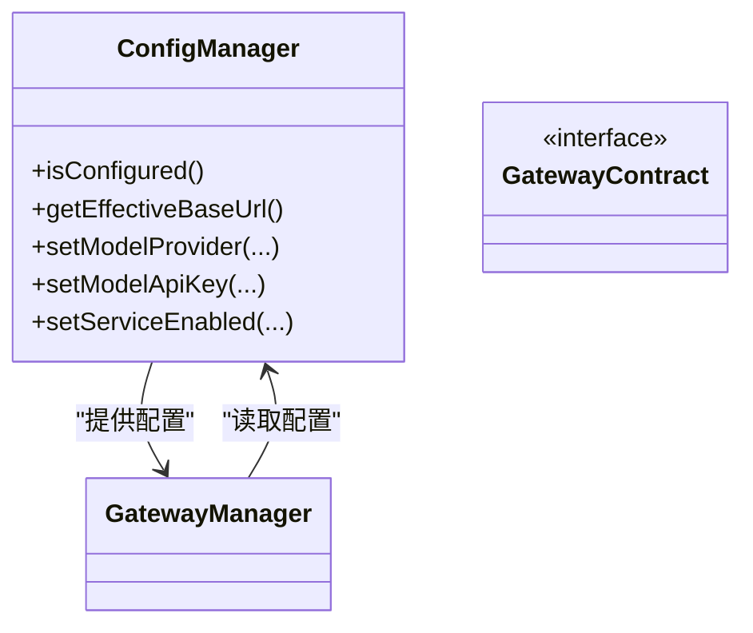

图表来源
- [ConfigManager.kt:11-52](file://app/src/main/java/ai/openclaw/android/ConfigManager.kt#L11-L52)
- [ConfigManager.kt:129-149](file://app/src/main/java/ai/openclaw/android/ConfigManager.kt#L129-L149)
- [GatewayContract.kt:15-34](file://app/src/main/java/ai/openclaw/android/GatewayContract.kt#L15-L34)
- [GatewayManager.kt:392-420](file://app/src/main/java/ai/openclaw/android/GatewayManager.kt#L392-L420)

章节来源
- [ConfigManager.kt:11-52](file://app/src/main/java/ai/openclaw/android/ConfigManager.kt#L11-L52)
- [GatewayContract.kt:15-34](file://app/src/main/java/ai/openclaw/android/GatewayContract.kt#L15-L34)
- [GatewayManager.kt:392-420](file://app/src/main/java/ai/openclaw/android/GatewayManager.kt#L392-L420)

## 依赖分析
- 组件内聚：GatewayManager高度内聚，负责组件初始化、状态与对外契约，符合SST原则。
- 组件耦合：Activity仅依赖GatewayContract，Service内部通过Manager解耦各子系统。
- 外部依赖：Room数据库加密、OkHttp网络、脚本引擎、模型客户端接口抽象。
- 循环依赖：未发现循环依赖；数据层DAO与领域层管理器通过Manager间接交互。

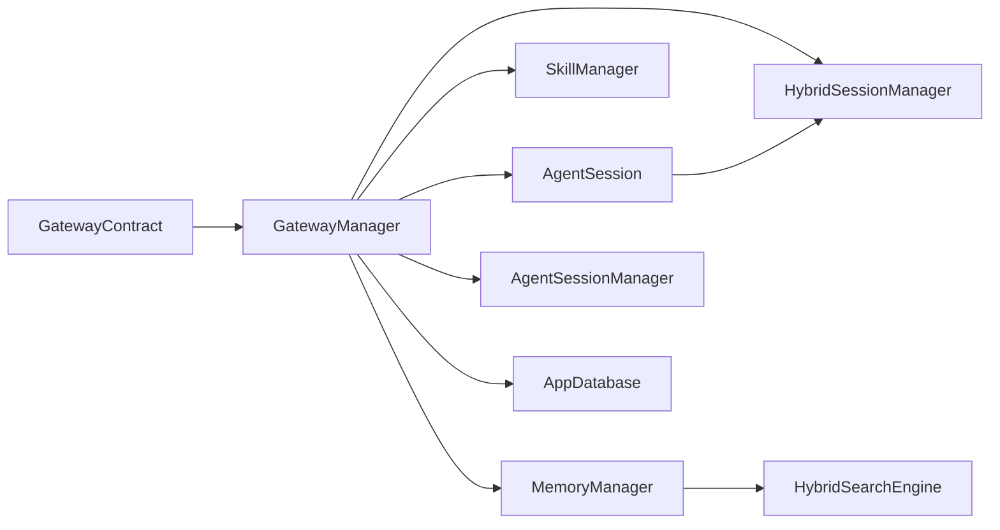

图表来源
- [GatewayContract.kt:15-34](file://app/src/main/java/ai/openclaw/android/GatewayContract.kt#L15-L34)
- [GatewayManager.kt:65-110](file://app/src/main/java/ai/openclaw/android/GatewayManager.kt#L65-L110)
- [AppDatabase.kt:25-41](file://app/src/main/java/ai/openclaw/android/data/local/AppDatabase.kt#L25-L41)
- [HybridSearchEngine.kt:18-23](file://app/src/main/java/ai/openclaw/android/domain/memory/HybridSearchEngine.kt#L18-L23)

章节来源
- [GatewayManager.kt:65-110](file://app/src/main/java/ai/openclaw/android/GatewayManager.kt#L65-L110)
- [AppDatabase.kt:25-41](file://app/src/main/java/ai/openclaw/android/data/local/AppDatabase.kt#L25-L41)

## 性能考虑
- 前台服务：确保后台稳定运行，避免系统回收；通知通道与低优先级通知降低打扰。
- 流式响应：AgentSession采用流式事件，UI即时反馈，减少等待感。
- 令牌估算与历史裁剪：防止上下文过长导致性能下降与成本上升。
- 摘要与LRU缓存：HybridSessionManager对摘要进行LRU缓存，减少重复计算。
- 向量检索缓存：HybridSearchEngine对向量相似度结果做短期缓存，降低重复计算。
- 并发搜索：HybridSearchEngine异步并行执行BM25与向量路径，缩短响应时间。
- LRU会话缓存：AgentSessionManager限制缓存大小，避免内存膨胀。

## 故障排查指南
- 服务未就绪：检查ConfigManager配置是否完整；通过GatewayContract.isReady()判断。
- 连接状态异常：监听ACTION_STATUS_CHANGED广播，查看ConnectionState状态。
- 报错日志：GatewayService与GatewayManager均记录INFO/WARN/ERROR级别日志，定位问题。
- 权限问题：SkillManager在执行工具前进行权限校验，若缺失需引导用户授权。
- 屏幕捕获：MediaProjection需API 21+，且需用户授权；通过getScreenCaptureIntent与initScreenCapture初始化。
- 数据库异常：AppDatabase使用SQLCipher加密，注意密钥管理与迁移版本。

章节来源
- [GatewayService.kt:90-110](file://app/src/main/java/ai/openclaw/android/GatewayService.kt#L90-L110)
- [GatewayManager.kt:326-344](file://app/src/main/java/ai/openclaw/android/GatewayManager.kt#L326-L344)
- [SkillManager.kt:89-107](file://app/src/main/java/ai/openclaw/android/skill/SkillManager.kt#L89-L107)
- [ConfigManager.kt:129-149](file://app/src/main/java/ai/openclaw/android/ConfigManager.kt#L129-L149)
- [AppDatabase.kt:132-155](file://app/src/main/java/ai/openclaw/android/data/local/AppDatabase.kt#L132-L155)

## 结论
OpenClaw-Android通过Gateway Service Pattern实现了清晰的职责分离与稳定的契约接口，GatewayManager作为“单一真实来源”统一对接模型、技能、记忆与会话等子系统，既保证了系统的可维护性，也为未来的跨进程扩展预留了空间。前台服务确保后台稳定运行，结合流式响应与多种优化策略，为用户提供流畅的智能体验。