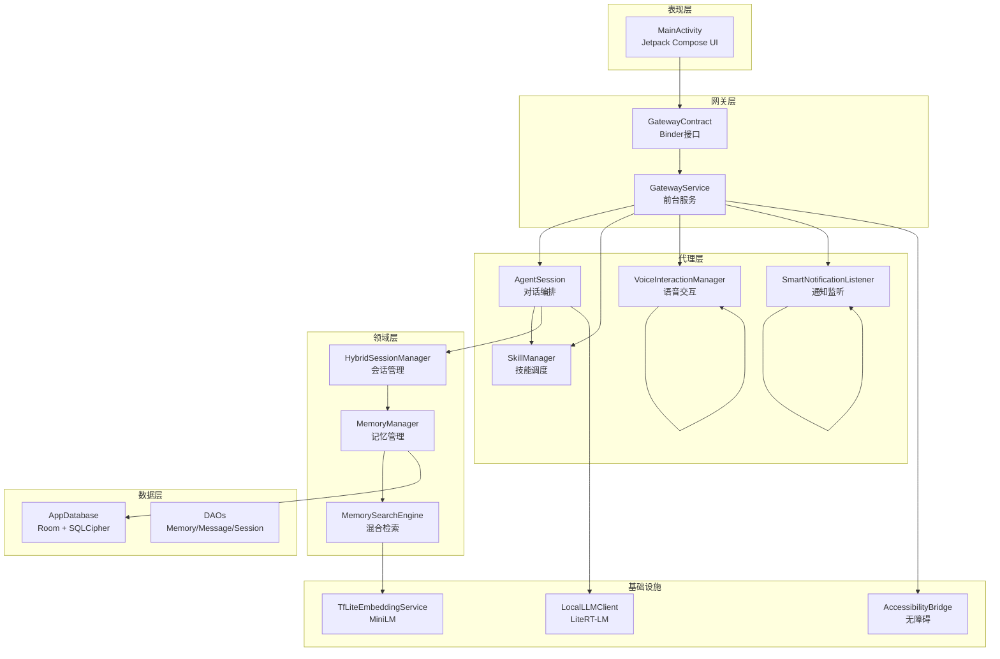
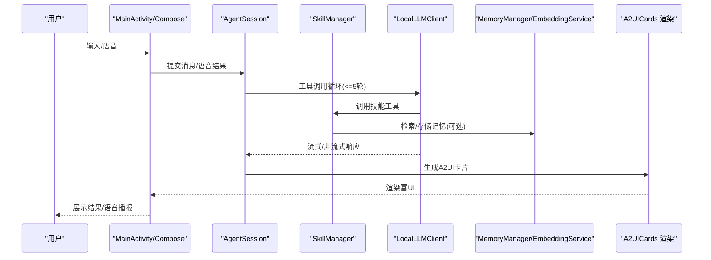
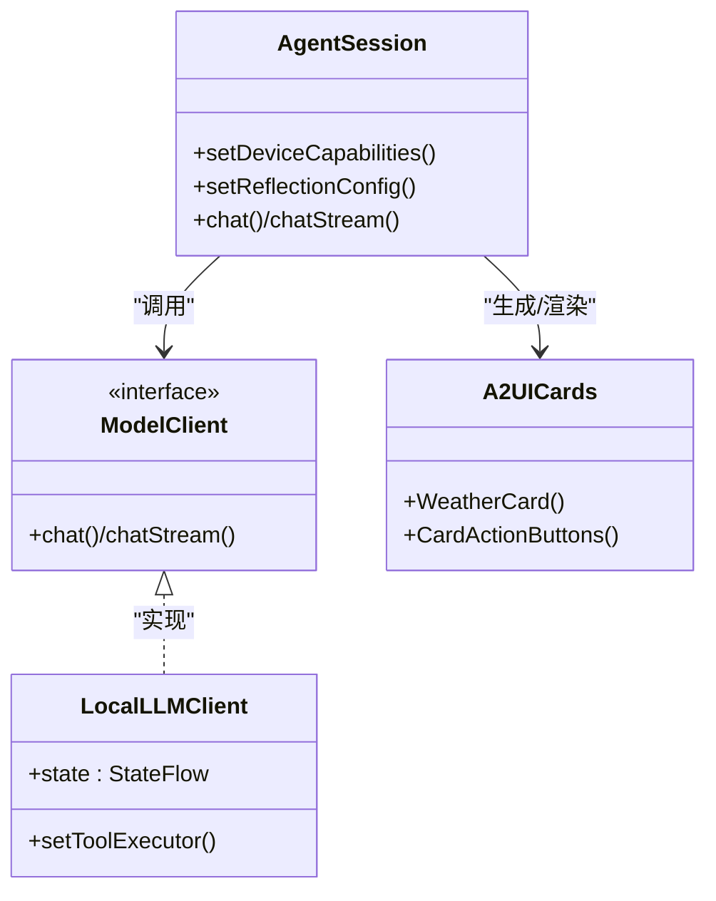
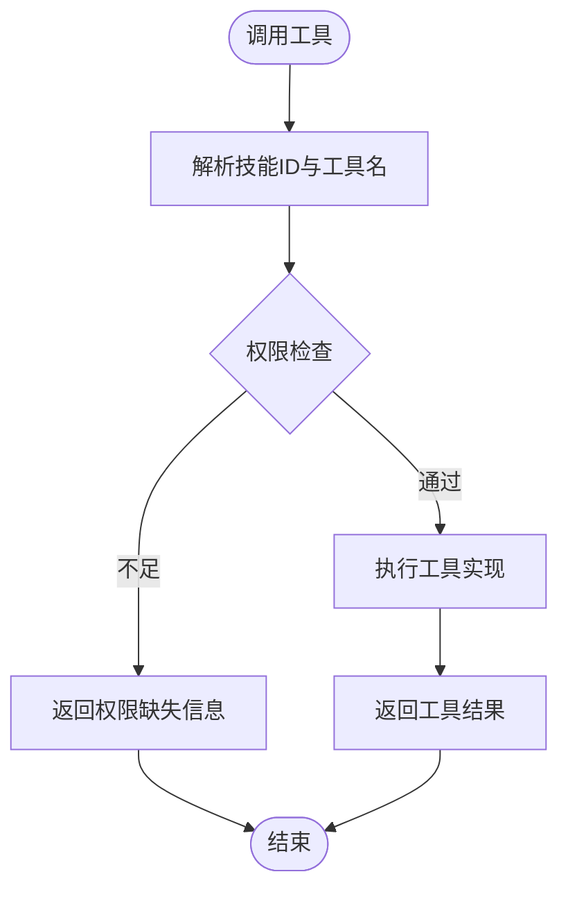
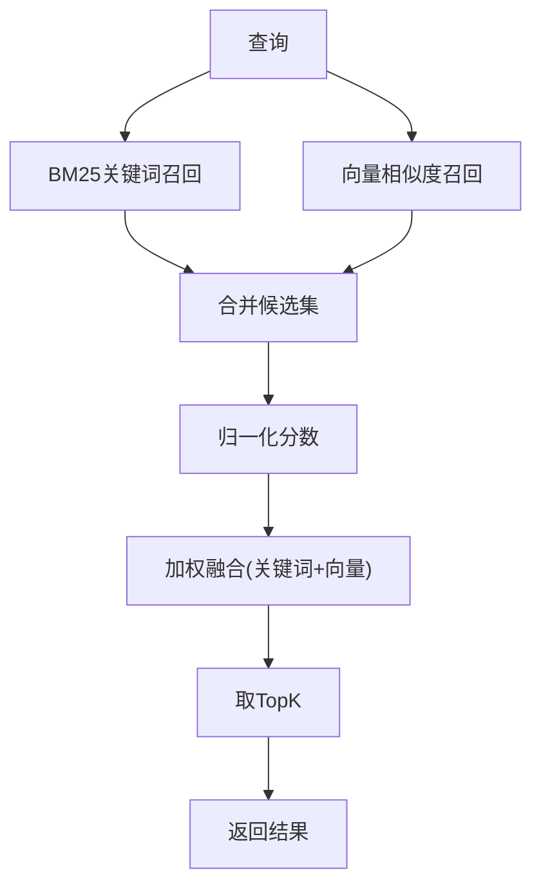
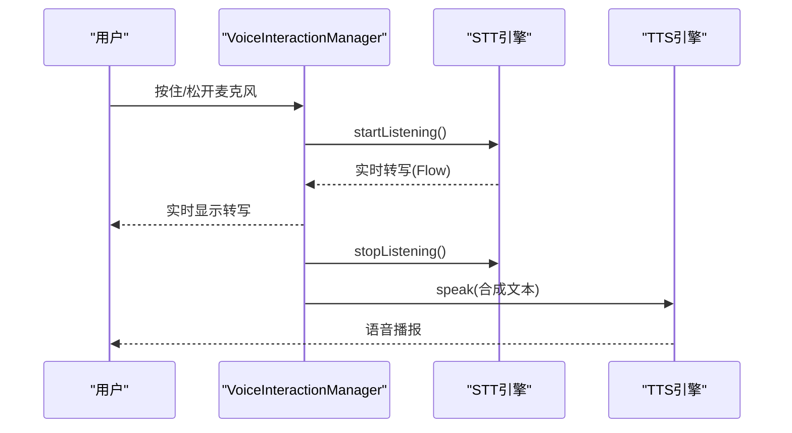
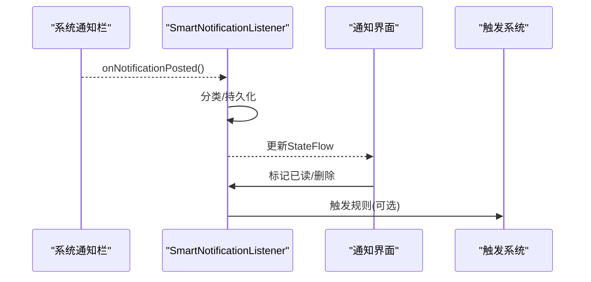
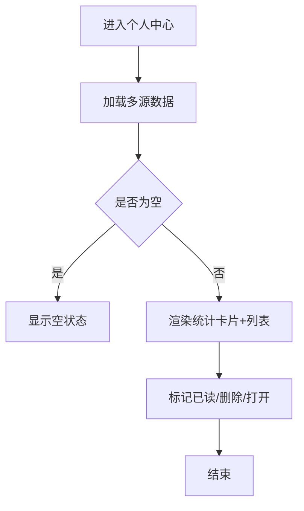
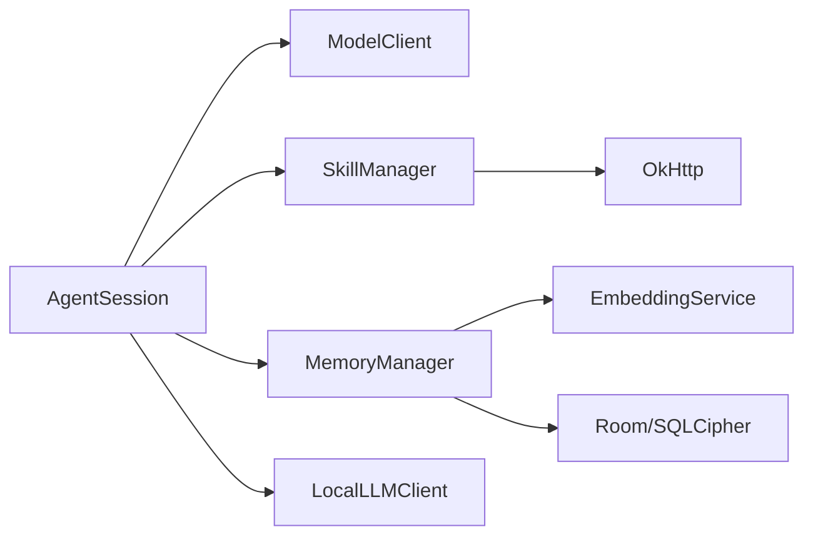

# 核心特性

<cite>
**本文引用的文件**   
- [README.md](file://README.md)
- [PROJECT.md](file://PROJECT.md)
- [a2ui-card-system-v2.md](file://docs/a2ui-card-system-v2.md)
- [current-status-2026-04-14.md](file://docs/current-status-2026-04-14.md)
- [AgentSession.kt](file://app/src/main/java/ai/openclaw/android/agent/AgentSession.kt)
- [SkillManager.kt](file://app/src/main/java/ai/openclaw/android/skill/SkillManager.kt)
- [MemoryManager.kt](file://app/src/main/java/ai/openclaw/android/domain/memory/MemoryManager.kt)
- [HybridSearchEngine.kt](file://app/src/main/java/ai/openclaw/android/memory/HybridSearchEngine.kt)
- [VoiceInteractionManager.kt](file://app/src/main/java/ai/openclaw/android/voice/VoiceInteractionManager.kt)
- [SmartNotificationListener.kt](file://app/src/main/java/ai/openclaw/android/notification/SmartNotificationListener.kt)
- [PersonalCenterScreen.kt](file://app/src/main/java/ai/openclaw/android/personalcenter/PersonalCenterScreen.kt)
- [A2UICards.kt](file://app/src/main/java/ai/openclaw/android/ui/A2UICards.kt)
- [LocalLLMClient.kt](file://app/src/main/java/ai/openclaw/android/model/LocalLLMClient.kt)
- [TfLiteEmbeddingService.kt](file://app/src/main/java/ai/openclaw/android/ml/TfLiteEmbeddingService.kt)
- [HybridSearchEngine.kt（内存计划参考）](file://docs/memory-plan-ref/HybridSearchEngine.kt)
</cite>

## 目录
1. [简介](#简介)
2. [项目结构](#项目结构)
3. [核心组件](#核心组件)
4. [架构总览](#架构总览)
5. [详细组件分析](#详细组件分析)
6. [依赖关系分析](#依赖关系分析)
7. [性能考量](#性能考量)
8. [故障排查指南](#故障排查指南)
9. [结论](#结论)
10. [附录](#附录)

## 简介
本文件面向OpenClaw-Android项目的核心特性，围绕六大模块进行系统化说明：AI对话系统、技能管理系统、内存系统、语音交互、通知管理、个人中心。文档强调本地LLM推理、混合检索、A2UI卡片系统等关键技术，并提供架构、流程、依赖与性能方面的深入解读，帮助开发者与用户快速理解项目能力与应用场景。

## 项目结构
项目采用“前台服务承载核心逻辑 + 纯UI层Activity”的Gateway Service架构，Agent层负责对话编排与工具调用，Domain层封装会话与记忆域逻辑，Data层以Room持久化为核心，Infrastructure层提供语音、通知、无障碍等基础设施能力。

图表来源
- [README.md: 9-152:9-152](file://README.md#L9-L152)
- [PROJECT.md: 105-175:105-175](file://PROJECT.md#L105-L175)

章节来源
- [README.md: 9-152:9-152](file://README.md#L9-L152)
- [PROJECT.md: 105-175:105-175](file://PROJECT.md#L105-L175)

## 核心组件
- AI对话系统：基于AgentSession的工具调用循环、流式响应与A2UI富渲染，支持本地LLM与云端模型切换。
- 技能管理系统：内置12项技能，统一工具定义与权限检查，支持动态脚本扩展。
- 内存系统：BM25关键词检索 + 向量语义检索融合，支持冷启动与遗忘曲线。
- 语音交互：统一STT/TTS引擎管理，支持Sherpa与Android原生引擎切换。
- 通知管理：监听系统通知并分类，提供UI展示与后续处理入口。
- 个人中心：聚合通知、日程、短信等多源信息，统一展示与操作。

章节来源
- [PROJECT.md: 188-238:188-238](file://PROJECT.md#L188-L238)
- [README.md: 49-88:49-88](file://README.md#L49-L88)

## 架构总览
下图展示从用户输入到响应呈现的关键数据流与组件交互，体现“本地推理 + 技能执行 + 记忆检索 + 富UI渲染”的闭环。

图表来源
- [PROJECT.md: 107-132:107-132](file://PROJECT.md#L107-L132)
- [AgentSession.kt: 29-106:29-106](file://app/src/main/java/ai/openclaw/android/agent/AgentSession.kt#L29-L106)
- [SkillManager.kt: 8-38:8-38](file://app/src/main/java/ai/openclaw/android/skill/SkillManager.kt#L8-L38)
- [LocalLLMClient.kt: 39-102:39-102](file://app/src/main/java/ai/openclaw/android/model/LocalLLMClient.kt#L39-L102)
- [A2UICards.kt: 1-200:1-200](file://app/src/main/java/ai/openclaw/android/ui/A2UICards.kt#L1-L200)

章节来源
- [PROJECT.md: 107-132:107-132](file://PROJECT.md#L107-L132)
- [AgentSession.kt: 29-106:29-106](file://app/src/main/java/ai/openclaw/android/agent/AgentSession.kt#L29-L106)
- [SkillManager.kt: 8-38:8-38](file://app/src/main/java/ai/openclaw/android/skill/SkillManager.kt#L8-L38)
- [LocalLLMClient.kt: 39-102:39-102](file://app/src/main/java/ai/openclaw/android/model/LocalLLMClient.kt#L39-L102)
- [A2UICards.kt: 1-200:1-200](file://app/src/main/java/ai/openclaw/android/ui/A2UICards.kt#L1-L200)

## 详细组件分析

### AI对话系统
- 职责与特性
  - 工具调用循环：最多50轮，支持链式工具调用与权限检查。
  - 流式响应：通过Flow发射Token/Complete/Error，支持实时展示。
  - A2UI富渲染：系统提示词引导输出标准A2UI协议，支持新旧格式兼容。
  - 本地/云端模型：统一ModelClient接口，支持LiteRT-LM本地推理与OpenAI/Anthropic/Bailian云端模型。
- 关键实现
  - AgentSession负责对话上下文、工具路由与A2UI生成。
  - LocalLLMClient桥接LiteRT-LM引擎，提供GPU/NPU/CPU加速与工具执行回调。
  - A2UICards提供卡片渲染与交互按钮回调。
- 使用场景
  - 本地隐私推理：在设备端完成对话与工具调用，避免网络依赖。
  - 多模态富UI：天气、提醒、日程等卡片化展示，提升移动端可读性。

图表来源
- [AgentSession.kt: 29-106:29-106](file://app/src/main/java/ai/openclaw/android/agent/AgentSession.kt#L29-L106)
- [LocalLLMClient.kt: 39-102:39-102](file://app/src/main/java/ai/openclaw/android/model/LocalLLMClient.kt#L39-L102)
- [A2UICards.kt: 173-200:173-200](file://app/src/main/java/ai/openclaw/android/ui/A2UICards.kt#L173-L200)

章节来源
- [AgentSession.kt: 29-106:29-106](file://app/src/main/java/ai/openclaw/android/agent/AgentSession.kt#L29-L106)
- [LocalLLMClient.kt: 39-102:39-102](file://app/src/main/java/ai/openclaw/android/model/LocalLLMClient.kt#L39-L102)
- [A2UICards.kt: 173-200:173-200](file://app/src/main/java/ai/openclaw/android/ui/A2UICards.kt#L173-L200)

### 技能管理系统
- 能力概览
  - 内置技能：天气、多搜索、翻译、提醒、日历、定位、联系人、短信、应用启动、系统设置、文件、脚本等共12项。
  - 工具定义：统一ToolDefinition，支持参数Schema与权限声明。
  - 权限管理：按技能粒度检查与提示，避免越权调用。
- 关键实现
  - SkillManager注册与调度内置技能，解析工具名并执行。
  - 动态脚本：ScriptSkill对接ScriptEngine，支持LLM生成JS脚本运行。
- 使用场景
  - 一键执行系统/第三方能力，如发送短信、设置提醒、查询天气。
  - 通过权限检查与用户确认降低高风险操作风险。

图表来源
- [SkillManager.kt: 62-107:62-107](file://app/src/main/java/ai/openclaw/android/skill/SkillManager.kt#L62-L107)

章节来源
- [SkillManager.kt: 8-38:8-38](file://app/src/main/java/ai/openclaw/android/skill/SkillManager.kt#L8-L38)
- [SkillManager.kt: 62-107:62-107](file://app/src/main/java/ai/openclaw/android/skill/SkillManager.kt#L62-L107)

### 内存系统
- 三层记忆模型
  - 感知记忆层：会话内短期记忆，环形缓冲。
  - 摘要记忆层：持久化语义向量，支持遗忘曲线与冲突检测。
  - 过程记忆层：任务状态机与多轮操作序列。
- 混合检索
  - BM25关键词召回 + 向量语义相似度 + 时间衰减融合，权重可配置。
  - 支持并行双路径召回与归并重排，提升召回质量与延迟。
- 关键实现
  - MemoryManager负责向量化、存储、检索与清理。
  - HybridSearchEngine实现双路召回与分数融合。
  - EmbeddingService支持TFLite/ONNX降级与缓存。
- 使用场景
  - 会话上下文增强：根据用户偏好与历史快速生成个性化回复。
  - 长期知识沉淀：通过记忆提取与遗忘曲线维持高质量知识库。

图表来源
- [HybridSearchEngine.kt: 52-75:52-75](file://app/src/main/java/ai/openclaw/android/memory/HybridSearchEngine.kt#L52-L75)
- [HybridSearchEngine.kt（内存计划参考）: 51-122:51-122](file://docs/memory-plan-ref/HybridSearchEngine.kt#L51-L122)
- [MemoryManager.kt: 38-61:38-61](file://app/src/main/java/ai/openclaw/android/domain/memory/MemoryManager.kt#L38-L61)
- [TfLiteEmbeddingService.kt: 13-30:13-30](file://app/src/main/java/ai/openclaw/android/ml/TfLiteEmbeddingService.kt#L13-L30)

章节来源
- [HybridSearchEngine.kt: 52-75:52-75](file://app/src/main/java/ai/openclaw/android/memory/HybridSearchEngine.kt#L52-L75)
- [HybridSearchEngine.kt（内存计划参考）: 51-122:51-122](file://docs/memory-plan-ref/HybridSearchEngine.kt#L51-L122)
- [MemoryManager.kt: 38-61:38-61](file://app/src/main/java/ai/openclaw/android/domain/memory/MemoryManager.kt#L38-L61)
- [TfLiteEmbeddingService.kt: 13-30:13-30](file://app/src/main/java/ai/openclaw/android/ml/TfLiteEmbeddingService.kt#L13-L30)

### 语音交互
- 统一语音接口
  - VoiceInteractionManager封装STT/TTS引擎初始化、状态管理与资源释放。
  - 支持Sherpa与Android原生引擎自动降级与切换。
- 交互流程
  - 按住麦克风开始录音，实时返回转写文本；松开结束，获取最终文本。
  - 可选语音播报，支持不同音色与引擎。
- 使用场景
  - 全语音对话：解放双手，适合驾驶、运动等场景。
  - 语音辅助：对视力障碍或操作不便用户提供便利。

图表来源
- [VoiceInteractionManager.kt: 45-141:45-141](file://app/src/main/java/ai/openclaw/android/voice/VoiceInteractionManager.kt#L45-L141)
- [VoiceInteractionManager.kt: 155-200:155-200](file://app/src/main/java/ai/openclaw/android/voice/VoiceInteractionManager.kt#L155-L200)

章节来源
- [VoiceInteractionManager.kt: 45-141:45-141](file://app/src/main/java/ai/openclaw/android/voice/VoiceInteractionManager.kt#L45-L141)
- [VoiceInteractionManager.kt: 155-200:155-200](file://app/src/main/java/ai/openclaw/android/voice/VoiceInteractionManager.kt#L155-L200)

### 通知管理
- 监听与分类
  - SmartNotificationListener监听系统通知，进行分类（紧急/重要/一般/噪声）。
  - 支持从系统主动拉取当前通知列表，作为技能数据源。
- UI与处理
  - 提供通知列表UI，支持标记已读、删除、刷新等操作。
  - 与触发系统联动，支持基于通知的自动化规则。
- 使用场景
  - 智能筛选：将海量通知按重要性分级，减少干扰。
  - 快速处理：一键跳转至相关应用或执行预设动作。

图表来源
- [SmartNotificationListener.kt: 190-200:190-200](file://app/src/main/java/ai/openclaw/android/notification/SmartNotificationListener.kt#L190-L200)
- [SmartNotificationListener.kt: 53-84:53-84](file://app/src/main/java/ai/openclaw/android/notification/SmartNotificationListener.kt#L53-L84)

章节来源
- [SmartNotificationListener.kt: 190-200:190-200](file://app/src/main/java/ai/openclaw/android/notification/SmartNotificationListener.kt#L190-L200)
- [SmartNotificationListener.kt: 53-84:53-84](file://app/src/main/java/ai/openclaw/android/notification/SmartNotificationListener.kt#L53-L84)

### 个人中心
- 能力概览
  - 聚合通知、日程、短信等多源信息，按重要性排序。
  - 提供统计卡片、批量操作与权限引导。
- 关键实现
  - PersonalCenterScreen基于Compose实现，支持加载、空状态、列表与操作。
  - 与通知、日历、短信等数据源对接，统一展示与跳转。
- 使用场景
  - 一站式查看与处理日常事务，提升信息整合效率。

图表来源
- [PersonalCenterScreen.kt: 44-111:44-111](file://app/src/main/java/ai/openclaw/android/personalcenter/PersonalCenterScreen.kt#L44-L111)

章节来源
- [PersonalCenterScreen.kt: 44-111:44-111](file://app/src/main/java/ai/openclaw/android/personalcenter/PersonalCenterScreen.kt#L44-L111)

## 依赖关系分析
- 组件耦合
  - AgentSession依赖ModelClient、SkillManager、会话与记忆域组件。
  - MemoryManager依赖EmbeddingService与DAO层，提供向量化与持久化能力。
  - SkillManager依赖OkHttp与Context，统一工具执行与权限检查。
- 外部依赖
  - LiteRT-LM提供本地推理与工具执行桥接。
  - TensorFlow Lite提供MiniLM嵌入模型。
  - Room + SQLCipher提供加密持久化。
- 循环依赖
  - 通过接口与单实例网关避免循环依赖，保持清晰边界。

图表来源
- [PROJECT.md: 177-184:177-184](file://PROJECT.md#L177-L184)
- [AgentSession.kt: 35-40:35-40](file://app/src/main/java/ai/openclaw/android/agent/AgentSession.kt#L35-L40)
- [SkillManager.kt: 8-11:8-11](file://app/src/main/java/ai/openclaw/android/skill/SkillManager.kt#L8-L11)
- [MemoryManager.kt: 10-14:10-14](file://app/src/main/java/ai/openclaw/android/domain/memory/MemoryManager.kt#L10-L14)

章节来源
- [PROJECT.md: 177-184:177-184](file://PROJECT.md#L177-L184)
- [AgentSession.kt: 35-40:35-40](file://app/src/main/java/ai/openclaw/android/agent/AgentSession.kt#L35-L40)
- [SkillManager.kt: 8-11:8-11](file://app/src/main/java/ai/openclaw/android/skill/SkillManager.kt#L8-L11)
- [MemoryManager.kt: 10-14:10-14](file://app/src/main/java/ai/openclaw/android/domain/memory/MemoryManager.kt#L10-L14)

## 性能考量
- 本地推理
  - LiteRT-LM在GPU/NPU/CPU间自动选择后端，推理速度约18-22 token/s，显著降低网络依赖与延迟。
- 搜索与检索
  - 混合检索采用并行双路径召回与归并重排，兼顾召回质量与时延。
  - 向量相似度计算采用余弦相似度，支持降级向量与LRU缓存。
- 语音交互
  - STT/TTS引擎支持Sherpa与Android原生自动切换，保证可用性与性能。
- UI渲染
  - A2UI卡片系统统一渲染，减少长文本滚动与解析成本，提升移动端可读性。

章节来源
- [README.md: 51-62:51-62](file://README.md#L51-L62)
- [HybridSearchEngine.kt: 77-104:77-104](file://app/src/main/java/ai/openclaw/android/memory/HybridSearchEngine.kt#L77-L104)
- [VoiceInteractionManager.kt: 98-141:98-141](file://app/src/main/java/ai/openclaw/android/voice/VoiceInteractionManager.kt#L98-L141)

## 故障排查指南
- 本地模型加载失败
  - 检查模型文件路径与权限，确认LiteRT-LM后端初始化超时与GPU崩溃重试策略。
- 语音引擎不可用
  - 确认RECORD_AUDIO权限，检查Sherpa/TTS模型路径，必要时回退到Android原生引擎。
- 通知监听无数据
  - 确认通知监听权限已授予，若服务未连接，使用系统主动拉取兜底。
- 记忆检索效果差
  - 检查EmbeddingService初始化状态与维度，确认BM25索引重建与向量缓存命中情况。

章节来源
- [LocalLLMClient.kt: 99-102:99-102](file://app/src/main/java/ai/openclaw/android/model/LocalLLMClient.kt#L99-L102)
- [VoiceInteractionManager.kt: 143-147:143-147](file://app/src/main/java/ai/openclaw/android/voice/VoiceInteractionManager.kt#L143-L147)
- [SmartNotificationListener.kt: 162-172:162-172](file://app/src/main/java/ai/openclaw/android/notification/SmartNotificationListener.kt#L162-L172)
- [HybridSearchEngine.kt: 137-141:137-141](file://app/src/main/java/ai/openclaw/android/memory/HybridSearchEngine.kt#L137-L141)

## 结论
OpenClaw-Android通过“本地LLM + 技能系统 + 混合记忆 + A2UI卡片 + 语音/通知/个人中心”的完整能力矩阵，实现了高隐私、强交互、可扩展的移动AI助手。项目在架构上坚持单一逻辑中心与清晰分层，在技术上采用混合检索与富UI渲染，既满足当前需求又为未来扩展预留空间。

## 附录
- A2UI卡片系统v2：统一卡片结构、风险等级与操作按钮，支持脚本动态生成卡片，向后兼容旧格式。
- 项目现状：A2UI v2全部完成，Gateway单实例模式落地，记忆系统五阶段优化完成，剩余TODO聚焦脚本引擎生产化与飞书集成。

章节来源
- [a2ui-card-system-v2.md: 1-625:1-625](file://docs/a2ui-card-system-v2.md#L1-L625)
- [current-status-2026-04-14.md: 23-50:23-50](file://docs/current-status-2026-04-14.md#L23-L50)