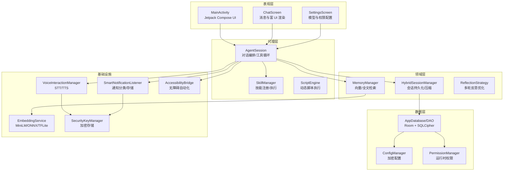
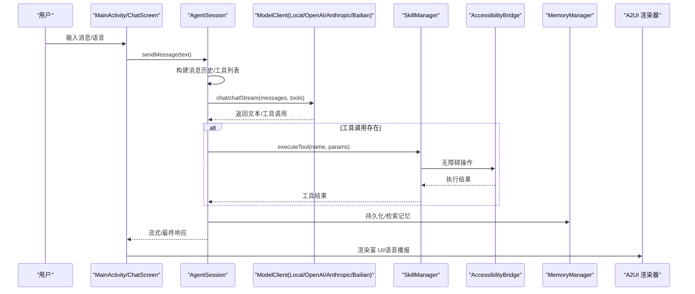
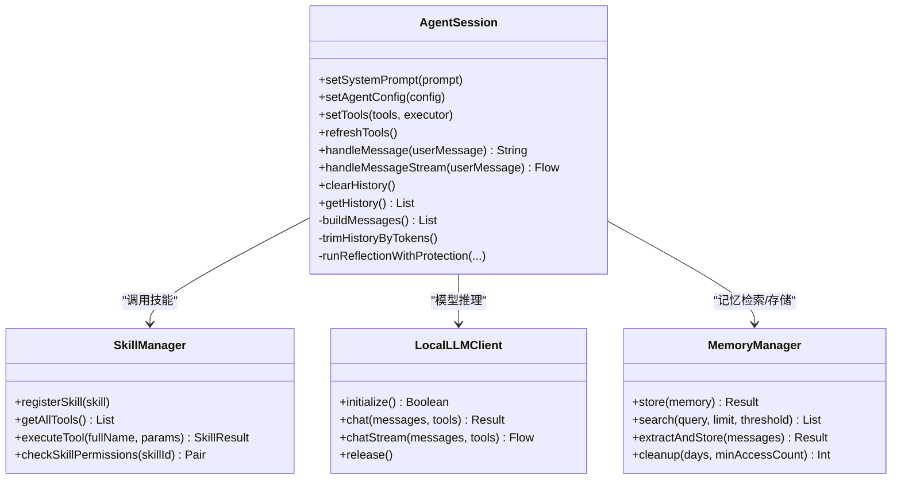
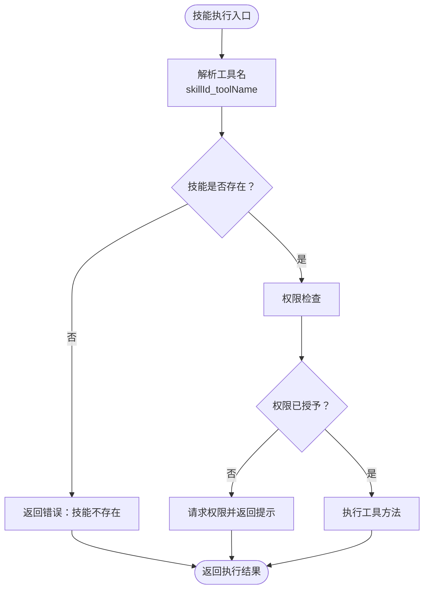
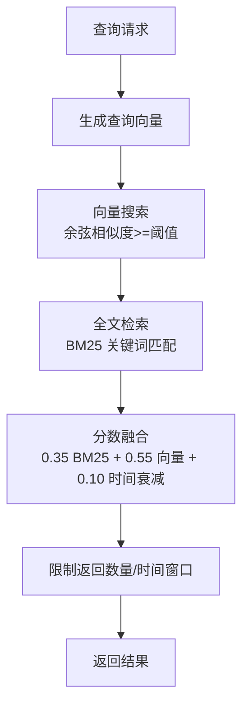
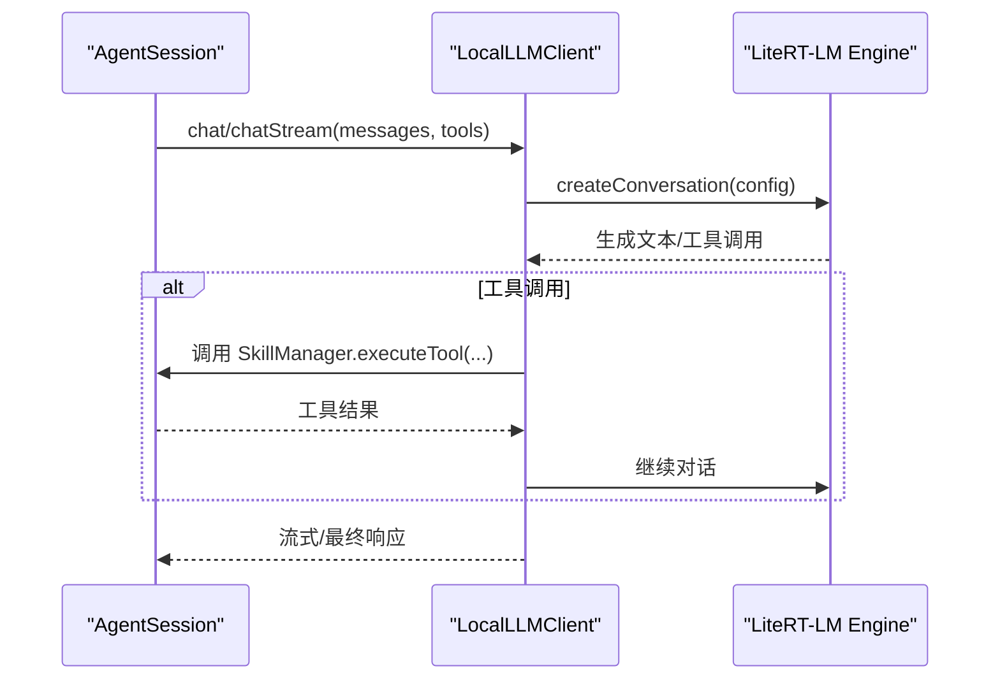
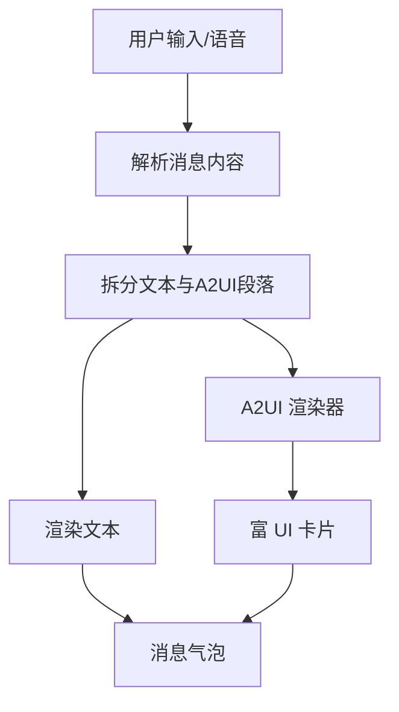
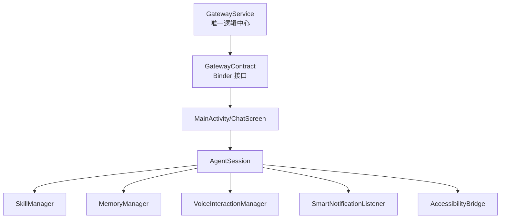
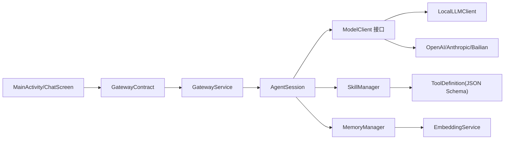

# 项目介绍

<cite>
**本文引用的文件**
- [README.md](file://README.md)
- [PROJECT.md](file://PROJECT.md)
- [OpenClawApplication.kt](file://app/src/main/java/ai/openclaw/android/OpenClawApplication.kt)
- [MainActivity.kt](file://app/src/main/java/ai/openclaw/android/MainActivity.kt)
- [AgentSession.kt](file://app/src/main/java/ai/openclaw/android/agent/AgentSession.kt)
- [SkillManager.kt](file://app/src/main/java/ai/openclaw/android/skill/SkillManager.kt)
- [MemoryManager.kt](file://app/src/main/java/ai/openclaw/android/domain/memory/MemoryManager.kt)
- [LocalLLMClient.kt](file://app/src/main/java/ai/openclaw/android/model/LocalLLMClient.kt)
- [ChatScreen.kt](file://app/src/main/java/ai/openclaw/android/ChatScreen.kt)
- [PROJECT-CONTEXT.md](file://docs/PROJECT-CONTEXT.md)
</cite>

## 目录
1. [引言](#引言)
2. [项目结构](#项目结构)
3. [核心组件](#核心组件)
4. [架构总览](#架构总览)
5. [详细组件分析](#详细组件分析)
6. [依赖关系分析](#依赖关系分析)
7. [性能考量](#性能考量)
8. [故障排查指南](#故障排查指南)
9. [结论](#结论)
10. [附录](#附录)

## 引言
OpenClaw-Android 是一个面向移动设备的 AI 驱动自动化平台，旨在将本地大模型推理与设备级自动化能力（无障碍服务）相结合，提供多模型支持（云端+本地）、技能插件系统、语音交互、持久记忆系统，并通过 A2UI 协议实现富 UI 渲染。项目以“单源真相”架构为核心，通过 GatewayService 作为唯一逻辑中心，将 UI 层与核心业务解耦，实现模型生命周期独立于 Activity、零重载时间、以及跨入口（聊天、通知、设置）的一致体验。

- 核心使命：在移动设备上实现“AI 驱动的自动化”，让用户通过自然语言与设备进行深度交互，完成日常任务与信息处理。
- 核心愿景：打造“本地优先、隐私安全、能力开放”的移动智能助手，逐步扩展到设备控制、多平台集成与多模态输入。

## 项目结构
项目采用分层架构与模块化组织，主要分为以下层次：
- 表现层（Presentation Layer）：MainActivity、ChatScreen、SettingsScreen 等 UI 组件，负责用户交互与状态展示。
- 代理层（Agent Layer）：AgentSession、SkillManager、ScriptEngine 等，负责对话编排、工具调用与技能执行。
- 领域层（Domain Layer）：会话管理（HybridSessionManager）、记忆系统（MemoryManager、HybridSearchEngine）、反射与优化（ReflectionStrategy）等。
- 数据层（Data Layer）：Room 数据库、DAO、实体定义、配置管理（ConfigManager）、权限管理（PermissionManager）。
- 基础设施（Infrastructure）：机器学习（EmbeddingService、TFLite/ONNX）、语音（STT/TTS）、通知监听（SmartNotificationListener）、无障碍桥接（AccessibilityBridge）、安全（SQLCipher、Android Keystore）。

图表来源
- [PROJECT.md:134-175](file://PROJECT.md#L134-L175)
- [README.md:89-152](file://README.md#L89-L152)

章节来源
- [PROJECT.md:105-175](file://PROJECT.md#L105-L175)
- [README.md:89-152](file://README.md#L89-L152)

## 核心组件
- GatewayService 与 GatewayContract：作为“单一真相”架构的核心，承载模型、会话、技能、通知、无障碍等所有核心组件，Activity 仅通过 Binder 接口调用，实现模型生命周期独立、Activity 销毁不影响模型状态。
- AgentSession：多轮对话编排中心，支持工具调用循环（最多 5 轮）、流式响应、Token 感知与历史截断、A2UI 兜底与反思优化。
- SkillManager：内置 11 个技能（天气、搜索、翻译、提醒、日历、定位、联系人、短信、应用启动、系统设置、文件操作、通知、脚本），支持动态技能生成与权限检查。
- MemoryManager：三层记忆模型（感知/摘要/过程），支持 BM25 全文检索 + 向量语义检索 + 时间衰减融合，具备遗忘曲线、冲突检测与去重。
- LocalLLMClient：基于 LiteRT-LM 的本地 Gemma 4 E4B 推理，支持 GPU/NPU/CPU 自动选择与回退，提供同步/流式接口。
- ChatScreen：Jetpack Compose 实现的聊天界面，支持 A2UI 协议富渲染、语音输入、能量条与科幻主题。
- AccessibilityBridge：将 AI 工具调用转换为无障碍操作，覆盖点击、输入、滑动、截图、屏幕内容读取等。
- SmartNotificationListener：通知监听、分类与存储，未来计划集成 TFLite 分类模型。
- VoiceInteractionManager：统一语音接口，支持长按模式 + 确认弹窗，STT/TTS 引擎自动选择（Sherpa/Android 原生）。

章节来源
- [README.md:7-48](file://README.md#L7-L48)
- [PROJECT.md:190-238](file://PROJECT.md#L190-L238)
- [PROJECT.md:240-293](file://PROJECT.md#L240-L293)
- [PROJECT.md:295-352](file://PROJECT.md#L295-L352)
- [PROJECT.md:354-384](file://PROJECT.md#L354-L384)
- [PROJECT.md:421-435](file://PROJECT.md#L421-L435)
- [PROJECT.md:437-450](file://PROJECT.md#L437-L450)
- [PROJECT.md:484-515](file://PROJECT.md#L484-L515)

## 架构总览
OpenClaw-Android 的整体数据流如下：用户输入（文本/语音）经由 MainActivity 的 Compose UI，进入 AgentSession 进行对话编排与工具调用循环，随后根据模型提供商（本地/云端）进行推理，工具调用由 SkillManager 或 AccessibilityBridge 执行，最终通过 A2UI 协议渲染富 UI 或语音播报。

图表来源
- [PROJECT.md:107-132](file://PROJECT.md#L107-L132)
- [AgentSession.kt:445-556](file://app/src/main/java/ai/openclaw/android/agent/AgentSession.kt#L445-L556)
- [SkillManager.kt:62-83](file://app/src/main/java/ai/openclaw/android/skill/SkillManager.kt#L62-L83)
- [LocalLLMClient.kt:335-388](file://app/src/main/java/ai/openclaw/android/model/LocalLLMClient.kt#L335-L388)

章节来源
- [PROJECT.md:107-132](file://PROJECT.md#L107-L132)
- [AgentSession.kt:445-556](file://app/src/main/java/ai/openclaw/android/agent/AgentSession.kt#L445-L556)
- [SkillManager.kt:62-83](file://app/src/main/java/ai/openclaw/android/skill/SkillManager.kt#L62-L83)
- [LocalLLMClient.kt:335-388](file://app/src/main/java/ai/openclaw/android/model/LocalLLMClient.kt#L335-L388)

## 详细组件分析

### AgentSession 组件分析
- 职责：对话编排中心，管理消息历史、工具调用循环、流式处理、Token 感知与历史截断、A2UI 兜底与反思优化。
- 关键特性：
  - 工具调用循环（最多 5 轮），支持链式工具调用与权限检查。
  - 流式响应（Flow<SessionEvent>），实时发射 Token/Complete/Error。
  - Token 感知与历史截断，避免超出上下文限制。
  - A2UI 兜底：ensureA2UIInResponse() 确保 LLM 输出富 UI 标记。
  - 反思优化：ReflectionStrategy 支持多轮自我改进，带超时保护与 A2UI 格式保护。

图表来源
- [AgentSession.kt:35-104](file://app/src/main/java/ai/openclaw/android/agent/AgentSession.kt#L35-L104)
- [SkillManager.kt:8-38](file://app/src/main/java/ai/openclaw/android/skill/SkillManager.kt#L8-L38)
- [LocalLLMClient.kt:48-71](file://app/src/main/java/ai/openclaw/android/model/LocalLLMClient.kt#L48-L71)
- [MemoryManager.kt:10-15](file://app/src/main/java/ai/openclaw/android/domain/memory/MemoryManager.kt#L10-L15)

章节来源
- [AgentSession.kt:29-200](file://app/src/main/java/ai/openclaw/android/agent/AgentSession.kt#L29-L200)
- [AgentSession.kt:445-556](file://app/src/main/java/ai/openclaw/android/agent/AgentSession.kt#L445-L556)
- [AgentSession.kt:716-789](file://app/src/main/java/ai/openclaw/android/agent/AgentSession.kt#L716-L789)

### SkillManager 组件分析
- 职责：加载与管理内置技能，提供工具定义与执行，进行权限检查与动态技能注册。
- 关键特性：
  - 内置技能清单（天气、搜索、翻译、提醒、日历、定位、联系人、短信、应用启动、系统设置、文件、通知、脚本）。
  - 工具命名规范：skillId_toolName，便于解析与路由。
  - 权限检查：针对日历、位置、联系人、短信等技能进行权限判断与请求。

图表来源
- [SkillManager.kt:62-83](file://app/src/main/java/ai/openclaw/android/skill/SkillManager.kt#L62-L83)
- [SkillManager.kt:89-107](file://app/src/main/java/ai/openclaw/android/skill/SkillManager.kt#L89-L107)

章节来源
- [SkillManager.kt:13-38](file://app/src/main/java/ai/openclaw/android/skill/SkillManager.kt#L13-L38)
- [SkillManager.kt:50-83](file://app/src/main/java/ai/openclaw/android/skill/SkillManager.kt#L50-L83)
- [SkillManager.kt:119-138](file://app/src/main/java/ai/openclaw/android/skill/SkillManager.kt#L119-L138)

### MemoryManager 组件分析
- 职责：记忆的存储、检索与清理，支持向量嵌入与全文检索融合。
- 关键特性：
  - 三层记忆模型：感知记忆（即时上下文）、摘要记忆（持久化向量）、过程记忆（任务状态）。
  - 向量检索：MiniLM 嵌入（TFLite/ONNX/Simple 降级），暴力搜索与余弦相似度评分。
  - 全文检索：BM25 关键词索引 + 时间分桶 + LRU 缓存。
  - 遗忘曲线：基于时效、频率、优先级的自动清理策略，保留≥20条。

图表来源
- [MemoryManager.kt:38-61](file://app/src/main/java/ai/openclaw/android/domain/memory/MemoryManager.kt#L38-L61)
- [PROJECT.md:342-351](file://PROJECT.md#L342-L351)

章节来源
- [MemoryManager.kt:16-36](file://app/src/main/java/ai/openclaw/android/domain/memory/MemoryManager.kt#L16-L36)
- [MemoryManager.kt:38-61](file://app/src/main/java/ai/openclaw/android/domain/memory/MemoryManager.kt#L38-L61)
- [MemoryManager.kt:87-95](file://app/src/main/java/ai/openclaw/android/domain/memory/MemoryManager.kt#L87-L95)

### LocalLLMClient 组件分析
- 职责：本地 Gemma 4 E4B 推理客户端，支持 GPU/NPU/CPU 自动选择与回退，提供同步/流式接口。
- 关键特性：
  - 模型发现与加载：优先用户配置模型，其次内置优先级列表，最后任意 .litertlm 文件。
  - Backend 优先级：NPU/GPU/CPU，华为/Honor 等机型特殊处理。
  - 工具调用桥接：将 LiteRT 的工具调用转发至 SkillManager。
  - 流式响应：Token 级别增量输出，支持错误回退解析工具调用。

图表来源
- [LocalLLMClient.kt:301-333](file://app/src/main/java/ai/openclaw/android/model/LocalLLMClient.kt#L301-L333)
- [LocalLLMClient.kt:335-388](file://app/src/main/java/ai/openclaw/android/model/LocalLLMClient.kt#L335-L388)
- [LocalLLMClient.kt:478-525](file://app/src/main/java/ai/openclaw/android/model/LocalLLMClient.kt#L478-L525)

章节来源
- [LocalLLMClient.kt:48-71](file://app/src/main/java/ai/openclaw/android/model/LocalLLMClient.kt#L48-L71)
- [LocalLLMClient.kt:175-286](file://app/src/main/java/ai/openclaw/android/model/LocalLLMClient.kt#L175-L286)
- [LocalLLMClient.kt:301-388](file://app/src/main/java/ai/openclaw/android/model/LocalLLMClient.kt#L301-L388)

### ChatScreen 组件分析
- 职责：Jetpack Compose 实现的聊天界面，支持 A2UI 协议富渲染、语音输入、能量条与科幻主题。
- 关键特性：
  - 消息气泡：用户消息青蓝渐变，AI 消息暗色背景+青色边框。
  - A2UI 渲染：解析消息中的 A2UI 标记并渲染卡片。
  - 语音交互：长按麦克风按钮开始/停止识别，支持权限请求与确认弹窗。
  - 无障碍菜单：长按消息显示复制/重新生成/分享/删除等选项。

图表来源
- [ChatScreen.kt:737-762](file://app/src/main/java/ai/openclaw/android/ChatScreen.kt#L737-L762)
- [ChatScreen.kt:768-806](file://app/src/main/java/ai/openclaw/android/ChatScreen.kt#L768-L806)

章节来源
- [ChatScreen.kt:206-230](file://app/src/main/java/ai/openclaw/android/ChatScreen.kt#L206-L230)
- [ChatScreen.kt:737-806](file://app/src/main/java/ai/openclaw/android/ChatScreen.kt#L737-L806)

### 概念总览
- Gateway Service 架构：通过 Binder 接口将 UI 与核心逻辑解耦，实现模型生命周期独立、Activity 销毁不影响模型状态、Feishu 消息与 UI 聊天共享同一 AgentSession。
- A2UI 协议：标准化富 UI 输出格式，支持多种组件类型与动作，确保 LLM 输出与 UI 渲染一致。
- 语音交互：长按模式 + 确认弹窗，STT/TTS 引擎自动选择（Sherpa/Android 原生），避免 ANR 与资源泄漏。
- 安全与隐私：SQLCipher + Android Keystore，加密数据库与配置，API Key 存储于 EncryptedSharedPreferences，审计日志与差分同步保障数据完整性。

图表来源
- [README.md:7-48](file://README.md#L7-L48)
- [PROJECT.md:518-541](file://PROJECT.md#L518-L541)

章节来源
- [README.md:7-48](file://README.md#L7-L48)
- [PROJECT.md:518-541](file://PROJECT.md#L518-L541)

## 依赖关系分析
- 组件耦合与内聚：
  - AgentSession 与 SkillManager、LocalLLMClient、MemoryManager 耦合度较高，但通过接口与工厂模式降低直接依赖。
  - MainActivity 仅依赖 GatewayContract，实现 UI 与核心逻辑的高内聚低耦合。
- 直接与间接依赖：
  - UI 层依赖 GatewayContract；Agent 层依赖 ModelClient、SkillManager、MemoryManager；数据层依赖 Room 与加密存储；基础设施依赖 ML/语音/通知/无障碍。
- 外部依赖与集成点：
  - LiteRT-LM（本地推理）、TensorFlow Lite/ONNX（嵌入模型）、OkHttp（网络）、SQLCipher（数据库加密）、AndroidX Security（加密存储）。
- 接口契约与实现细节：
  - ModelClient 接口抽象不同提供商（本地/云端），统一 chat/chatStream API。
  - SkillDefinition 描述工具参数与执行器类型，支持 10 种执行器类型（http/intent/content_resolver/location/alarm/sms/file/sensor/shell/accessibility）。

图表来源
- [README.md:9-48](file://README.md#L9-L48)
- [PROJECT.md:177-184](file://PROJECT.md#L177-L184)
- [PROJECT.md:258-281](file://PROJECT.md#L258-L281)

章节来源
- [README.md:9-48](file://README.md#L9-L48)
- [PROJECT.md:177-184](file://PROJECT.md#L177-L184)
- [PROJECT.md:258-281](file://PROJECT.md#L258-L281)

## 性能考量
- 本地推理性能：Gemma 4 E4B 在 GPU 上约 22 tok/s，CPU 约 18 tok/s，Backend 自动选择与回退，避免设备兼容性问题。
- 记忆检索优化：向量搜索采用 LruCache 与暴力搜索，BM25 + 向量 + 时间衰减融合，限制返回数量与时间窗口，降低延迟。
- 会话压缩与 Token 管理：基于 Token 估算与历史截断，避免上下文溢出；反射优化减少无效输出。
- 语音交互优化：IO Dispatcher 避免 ANR，长按模式 + 确认弹窗减少误触，STT/TTS 引擎自动选择。
- 安全与稳定性：GPU 初始化失败自动回退，崩溃标记与定时重试，防止反复尝试导致卡顿。

## 故障排查指南
- 本地模型未加载：
  - 检查模型文件是否存在（/sdcard/Download 或应用 filesDir/models），确认文件名与优先级列表匹配。
  - 查看初始化日志与 Backend 选择，必要时重置 GPU Crash 标记。
- 工具调用失败：
  - 检查技能权限是否授予，必要时通过 PermissionManager 请求权限。
  - 确认工具参数 JSON 是否正确，查看工具执行结果与错误信息。
- 记忆检索异常：
  - 检查 EmbeddingService 是否就绪，若不可用将使用降级伪向量。
  - 调整阈值与返回数量，确认 BM25 与向量索引状态。
- 语音交互问题：
  - 确认录音权限，检查 STT/TTS 引擎初始化状态，避免同时使用 pointerInput 与 detectTapGestures 导致冲突。
- 通知分类与存储：
  - 确认通知监听服务运行状态，ML 分类模型尚未上线时回退到规则引擎。

章节来源
- [LocalLLMClient.kt:175-286](file://app/src/main/java/ai/openclaw/android/model/LocalLLMClient.kt#L175-L286)
- [SkillManager.kt:89-107](file://app/src/main/java/ai/openclaw/android/skill/SkillManager.kt#L89-L107)
- [MemoryManager.kt:16-36](file://app/src/main/java/ai/openclaw/android/domain/memory/MemoryManager.kt#L16-L36)
- [PROJECT-CONTEXT.md:98-125](file://docs/PROJECT-CONTEXT.md#L98-L125)

## 结论
OpenClaw-Android 通过“单源真相”架构与多层解耦，实现了本地 LLM 推理、技能系统、记忆系统与设备自动化能力的深度融合。其核心优势在于：
- 设备级自动化（AI 驱动的设备操控，竞品 App 均不具备）
- 本地 LLM 推理（隐私敏感场景优势）
- 开放技能架构（插件式扩展）
- 通知智能处理（ML 分类 + LLM 理解）
- 多模型切换灵活性

对于初学者与开发者，建议从 GatewayService 架构入手理解项目定位，再深入 AgentSession、SkillManager、MemoryManager 等核心模块，逐步掌握本地推理、技能扩展与记忆检索的关键实现。

## 附录
- 项目要求与构建：Android SDK 35、Kotlin 1.9.25、Gradle 8.9，支持 Debug/Release 构建与签名。
- 安全与合规：API Key 存储于加密 SharedPreferences，数据库使用 SQLCipher，运行时权限与审计日志保障数据安全。
- 发展规划：M1（基础稳固）→ M2（体验提升）→ M3（差异化竞争），逐步完善多模态输入、CI/CD、国际化与无障碍自动化增强。

章节来源
- [README.md:154-191](file://README.md#L154-L191)
- [PROJECT.md:592-604](file://PROJECT.md#L592-L604)
- [PROJECT.md:645-688](file://PROJECT.md#L645-L688)