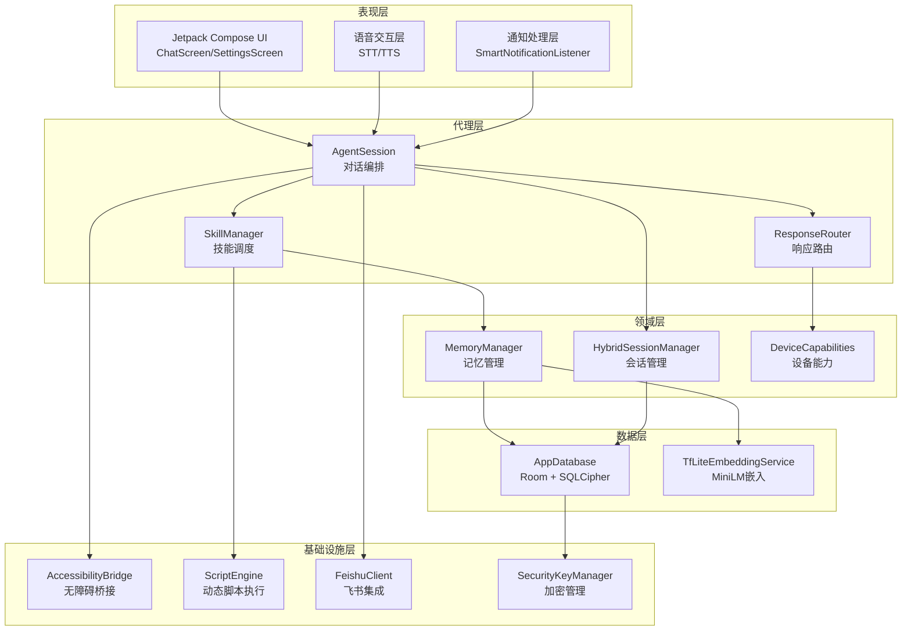
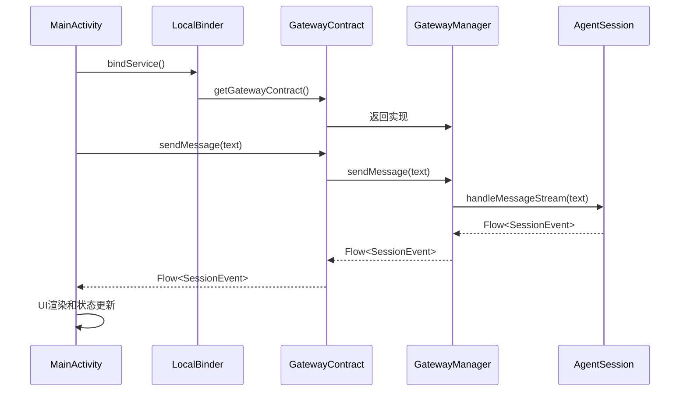
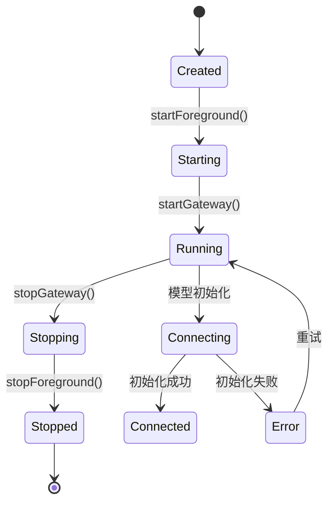
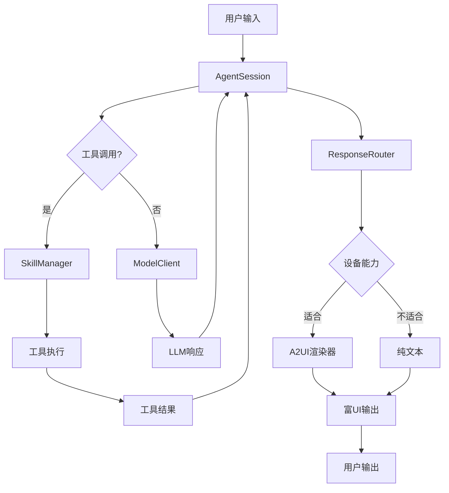
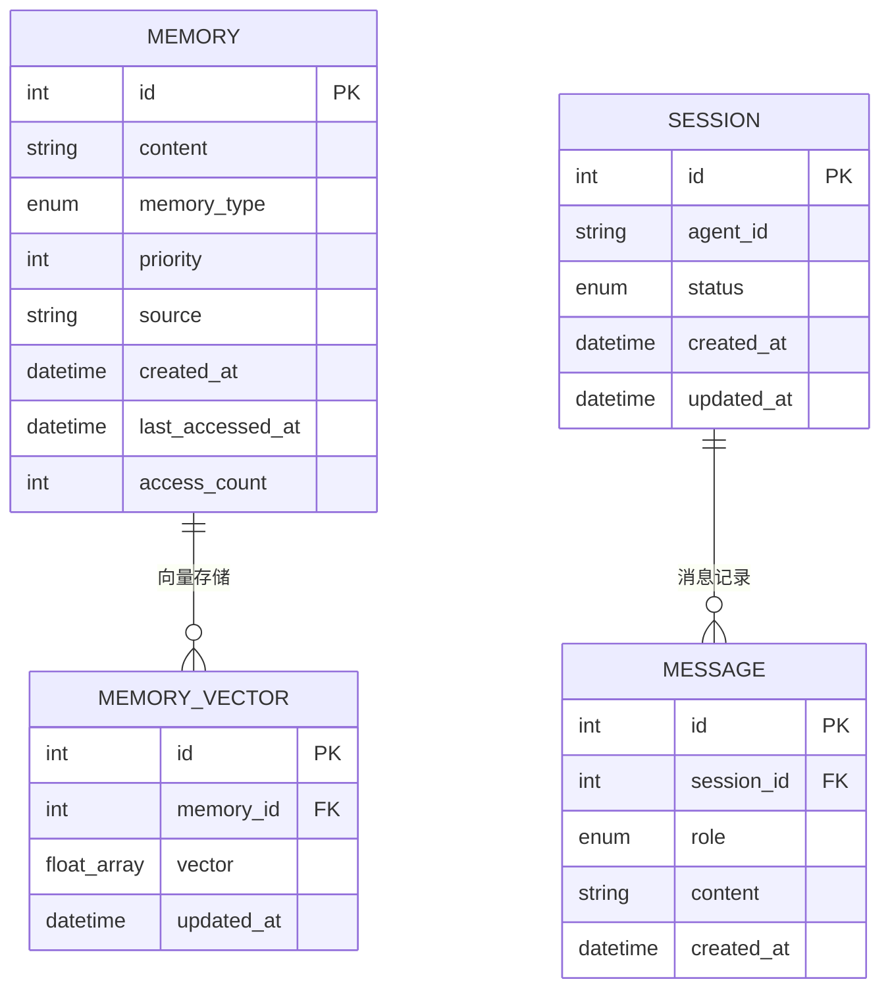
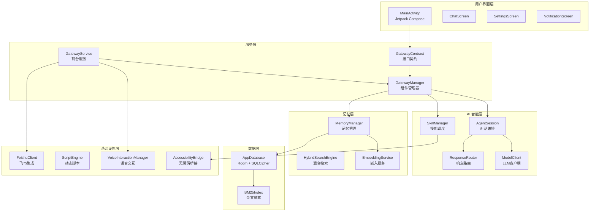
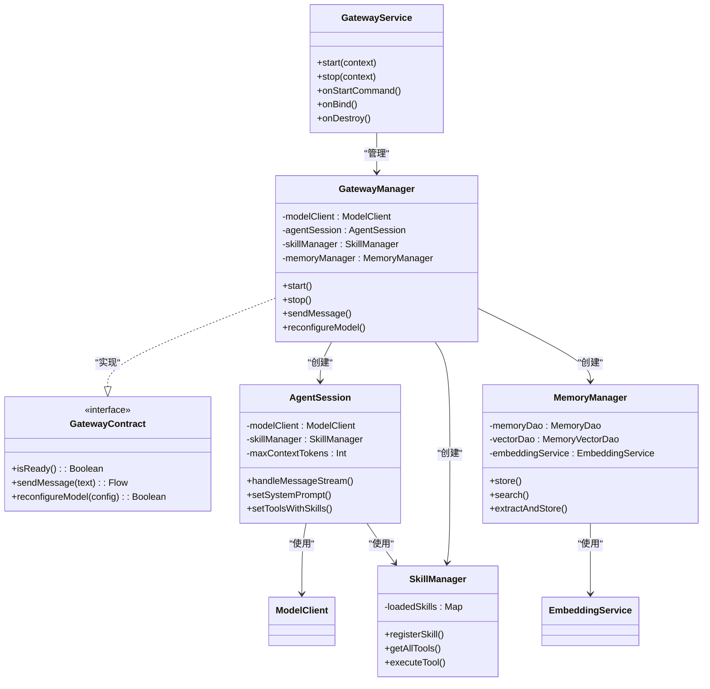
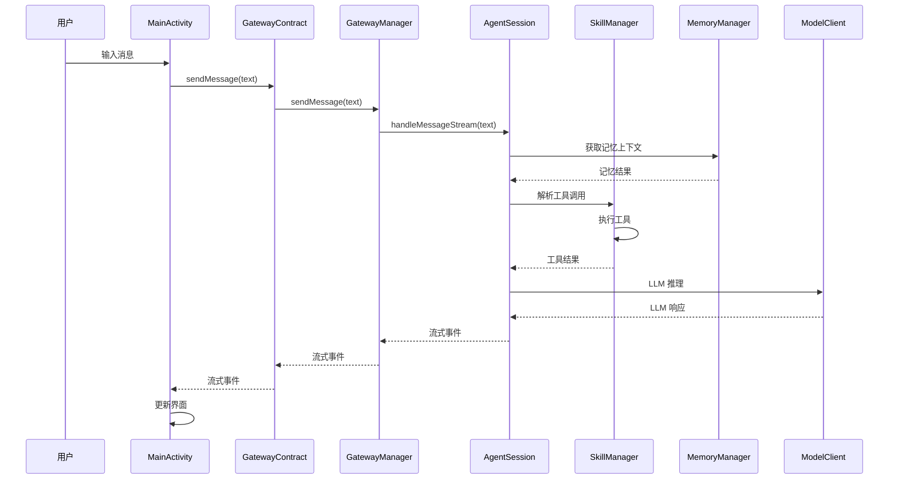

# 项目概述

<cite>
**本文引用的文件**
- [README.md](file://README.md)
- [PROJECT.md](file://PROJECT.md)
- [GatewayService.kt](file://app/src/main/java/ai/openclaw/android/GatewayService.kt)
- [GatewayManager.kt](file://app/src/main/java/ai/openclaw/android/GatewayManager.kt)
- [GatewayContract.kt](file://app/src/main/java/ai/openclaw/android/GatewayContract.kt)
- [MainActivity.kt](file://app/src/main/java/ai/openclaw/android/MainActivity.kt)
- [OpenClawApplication.kt](file://app/src/main/java/ai/openclaw/android/OpenClawApplication.kt)
- [AgentSession.kt](file://app/src/main/java/ai/openclaw/android/agent/AgentSession.kt)
- [SkillManager.kt](file://app/src/main/java/ai/openclaw/android/skill/SkillManager.kt)
- [MemoryManager.kt](file://app/src/main/java/ai/openclaw/android/domain/memory/MemoryManager.kt)
- [AppDatabase.kt](file://app/src/main/java/ai/openclaw/android/data/local/AppDatabase.kt)
- [TfLiteEmbeddingService.kt](file://app/src/main/java/ai/openclaw/android/ml/TfLiteEmbeddingService.kt)
</cite>

## 目录
1. [项目简介](#项目简介)
2. [项目定位与价值主张](#项目定位与价值主张)
3. [技术架构理念](#技术架构理念)
4. [Gateway Service Pattern 设计思想](#gateway-service-pattern-设计思想)
5. [AI 驱动的移动自动化平台](#ai-驱动的移动自动化平台)
6. [技术栈与设计决策](#技术栈与设计决策)
7. [整体架构图](#整体架构图)
8. [核心组件关系说明](#核心组件关系说明)
9. [性能与安全性考量](#性能与安全性考量)
10. [结语](#结语)

## 项目简介

OpenClaw-Android 是一个基于 Android 平台的 AI Agent 应用，将大型语言模型（LLM）智能与设备级自动化能力（无障碍服务）相结合。该项目支持多 LLM 提供商（云端 + 本地）、技能插件系统、语音交互、持久记忆系统，并通过 A2UI 协议实现富 UI 渲染。其核心目标是打造一个“AI 驱动的移动自动化平台”，在保护用户隐私的同时，提供强大的设备控制能力和智能对话体验。

## 项目定位与价值主张

### 1.1 项目定位
- **AI 驱动的移动自动化平台**：将 LLM 与 Android 设备控制能力深度融合，实现真正的“智能代理”。
- **隐私优先的本地推理**：支持 Gemma 4 E4B 本地模型，满足隐私敏感场景需求。
- **开放技能架构**：内置 12 个技能，支持动态生成和扩展，形成开放的技能生态系统。
- **多平台集成**：支持飞书机器人、通知智能处理、语音交互等多种外部系统集成。

### 1.2 核心价值主张
- **设备级自动化**：通过无障碍服务实现屏幕读取、点击、输入、手势等底层操作，这是竞品应用所不具备的能力。
- **本地 LLM 推理**：在设备端运行，完全离线，保护用户隐私。
- **开放技能扩展**：插件式技能架构，支持动态生成和用户自定义技能。
- **智能通知处理**：基于机器学习的通知分类与理解，提升信息处理效率。
- **多模型切换灵活性**：支持阿里百炼、OpenAI、Anthropic 等多家云厂商，以及本地 Gemma 4 模型。

## 技术架构理念

### 2.1 分层架构设计
项目采用清晰的分层架构，确保关注点分离和职责明确：

**图表来源**
- [PROJECT.md: 134-175:134-175](file://PROJECT.md#L134-L175)
- [GatewayService.kt: 31-88:31-88](file://app/src/main/java/ai/openclaw/android/GatewayService.kt#L31-L88)
- [GatewayManager.kt: 64-107:64-107](file://app/src/main/java/ai/openclaw/android/GatewayManager.kt#L64-L107)

### 2.2 单一真实来源架构
项目采用"单一真实来源"（Single Source of Truth）架构，所有核心组件都集中在 GatewayService 中，确保状态一致性和资源复用。

**核心优势**：
- **节省内存**：单一模型实例，避免多个 Activity 实例造成的 3.5GB 内存浪费
- **零重载时间**：Activity 销毁不影响模型状态，实现零重载时间
- **状态一致性**：所有组件共享同一 AgentSession，确保聊天和飞书消息的一致性
- **职责分离**：Activity 仅负责 UI，业务逻辑集中在服务中

## Gateway Service Pattern 设计思想

### 3.1 设计模式概述
Gateway Service Pattern 是项目的核心架构模式，通过一个前台服务作为"单一逻辑中心"，管理所有核心组件。

**图表来源**
- [GatewayService.kt: 70-73:70-73](file://app/src/main/java/ai/openclaw/android/GatewayService.kt#L70-L73)
- [GatewayContract.kt: 14-33:14-33](file://app/src/main/java/ai/openclaw/android/GatewayContract.kt#L14-L33)
- [GatewayManager.kt: 115-127:115-127](file://app/src/main/java/ai/openclaw/android/GatewayManager.kt#L115-L127)

### 3.2 接口契约设计
GatewayContract 作为清洁的 API 边界，为 Activity 和服务之间提供稳定的接口：

| 方法 | 功能 | 返回值 |
|------|------|--------|
| isReady() | 检查服务就绪状态 | Boolean |
| getModelLoadState() | 获取本地模型加载状态 | LocalLLMClient.LoadState? |
| getConnectionState() | 获取连接状态流 | StateFlow<ConnectionState> |
| sendMessage(text) | 发送消息并获取流式响应 | Flow<SessionEvent> |
| reconfigureModel(config) | 重新配置模型 | Boolean |
| getAvailableSkills() | 获取可用技能列表 | List<SkillInfo> |
| getAvailableAgents() | 获取可用代理列表 | List<AgentInfo> |
| getScreenCaptureIntent() | 获取屏幕捕获权限 | Intent? |
| initScreenCapture() | 初始化屏幕捕获 | Boolean |

### 3.3 生命周期管理
GatewayService 采用前台服务模式，确保在后台稳定运行：

**图表来源**
- [GatewayService.kt: 90-110:90-110](file://app/src/main/java/ai/openclaw/android/GatewayService.kt#L90-L110)
- [GatewayManager.kt: 325-344:325-344](file://app/src/main/java/ai/openclaw/android/GatewayManager.kt#L325-L344)

## AI 驱动的移动自动化平台

### 4.1 AI 智能对话系统
AgentSession 作为对话编排中心，支持多轮对话和工具调用：

**图表来源**
- [AgentSession.kt: 35-40:35-40](file://app/src/main/java/ai/openclaw/android/agent/AgentSession.kt#L35-L40)
- [SkillManager.kt: 62-83:62-83](file://app/src/main/java/ai/openclaw/android/skill/SkillManager.kt#L62-L83)

### 4.2 本地 LLM 推理
支持 Gemma 4 E4B 本地模型，提供完全离线的推理能力：

| 特性 | 描述 |
|------|------|
| 模型 | Gemma 4 E4B (4B 参数, ~3.5GB) |
| 推理速度 | ~18 tok/s (CPU) / ~22 tok/s (GPU) |
| 后端优先级 | NPU → GPU → CPU |
| Token 预算 | E4B: 15872 tokens / E2B: 7680 tokens |
| 本地存储 | `/sdcard/Download/gemma-4-E4B-it.litertlm` |

### 4.3 技能系统架构
内置 12 个技能，支持动态生成和扩展：

| 技能类别 | 技能数量 | 主要功能 |
|----------|----------|----------|
| 基础服务 | 6 | 天气、翻译、提醒、日历、定位、联系人 |
| 系统控制 | 4 | 短信、应用启动、系统设置、文件操作 |
| 智能辅助 | 2 | 通知管理、脚本执行 |

### 4.4 记忆系统设计
采用三层记忆模型，实现从感知到长期记忆的完整闭环：

**图表来源**
- [MemoryManager.kt: 10-36:10-36](file://app/src/main/java/ai/openclaw/android/domain/memory/MemoryManager.kt#L10-L36)
- [AppDatabase.kt: 25-40:25-40](file://app/src/main/java/ai/openclaw/android/data/local/AppDatabase.kt#L25-L40)

## 技术栈与设计决策

### 5.1 核心技术栈
项目采用现代化的 Android 开发技术栈，确保性能和可维护性：

| 分类 | 技术 | 版本 | 用途 |
|------|------|------|------|
| 语言 | Kotlin | 2.3.0 | 主要开发语言 |
| UI | Jetpack Compose | BOM 2025.03.00 | 声明式 UI |
| 构建 | Android Gradle Plugin | 8.7.3 | 项目构建 |
| 网络 | OkHttp + SSE | 4.12.0 | API 通信 |
| 序列化 | Kotlinx Serialization | 1.8.0 | JSON 处理 |
| 数据库 | Room + KSP | 2.7.2 | 本地数据存储 |
| 本地推理 | LiteRT-LM | 0.10.0 | 设备端 LLM |
| ML 推理 | TensorFlow Lite | 2.16.1 | 嵌入模型 |
| 嵌入模型 | MiniLM-L6-v2 | 384 维 | 语义搜索 |

### 5.2 关键设计决策

#### 5.2.1 Gateway Service 架构
- **单一实例原则**：所有核心组件（LLM、Agent、Skills、Memory）都位于前台服务中
- **接口契约**：通过 GatewayContract 为 Activity 提供清洁的 API 边界
- **跨进程兼容**：为未来迁移到远程服务预留接口

#### 5.2.2 混合记忆搜索
- **BM25 + 向量 + 时间衰减**：0.35 BM25 + 0.55 向量 + 0.10 时间衰减
- **冷启动管理**：前 72 小时使用轻量级记忆模式
- **遗忘曲线**：0.4×recency + 0.4×frequency + 0.2×priority

#### 5.2.3 安全性设计
- **端到端加密**：SQLCipher + Android Keystore
- **配置加密**：EncryptedSharedPreferences
- **脚本沙箱**：Rhino 安全对象 + 路径隔离
- **权限最小化**：按需申请，权限检查

## 整体架构图

**图表来源**
- [README.md: 7-41:7-41](file://README.md#L7-L41)
- [PROJECT.md: 105-175:105-175](file://PROJECT.md#L105-L175)
- [GatewayService.kt: 31-88:31-88](file://app/src/main/java/ai/openclaw/android/GatewayService.kt#L31-L88)

## 核心组件关系说明

### 6.1 组件依赖关系

**图表来源**
- [GatewayService.kt: 31-88:31-88](file://app/src/main/java/ai/openclaw/android/GatewayService.kt#L31-L88)
- [GatewayManager.kt: 64-107:64-107](file://app/src/main/java/ai/openclaw/android/GatewayManager.kt#L64-L107)
- [GatewayContract.kt: 14-33:14-33](file://app/src/main/java/ai/openclaw/android/GatewayContract.kt#L14-L33)
- [AgentSession.kt: 35-40:35-40](file://app/src/main/java/ai/openclaw/android/agent/AgentSession.kt#L35-L40)
- [SkillManager.kt: 8-11:8-11](file://app/src/main/java/ai/openclaw/android/skill/SkillManager.kt#L8-L11)
- [MemoryManager.kt: 10-15:10-15](file://app/src/main/java/ai/openclaw/android/domain/memory/MemoryManager.kt#L10-L15)

### 6.2 数据流处理

**图表来源**
- [MainActivity.kt: 378-455:378-455](file://app/src/main/java/ai/openclaw/android/MainActivity.kt#L378-L455)
- [GatewayManager.kt: 115-127:115-127](file://app/src/main/java/ai/openclaw/android/GatewayManager.kt#L115-L127)
- [AgentSession.kt: 398-448:398-448](file://app/src/main/java/ai/openclaw/android/agent/AgentSession.kt#L398-L448)

## 性能与安全性考量

### 7.1 性能优化策略

#### 7.1.1 内存管理
- **单一实例模式**：避免多个 Activity 实例造成的内存浪费（7GB+）
- **模型生命周期管理**：本地模型与 Activity 生命周期解耦
- **向量缓存**：EmbeddingService 添加 LruCache(100) 优化性能

#### 7.1.2 推理优化
- **硬件加速**：NPU → GPU → CPU 自动选择
- **批处理**：TfLiteEmbeddingService 支持批量嵌入
- **异步处理**：所有长耗时操作都在 IO 线程执行

### 7.2 安全性设计

#### 7.2.1 数据加密
- **数据库加密**：SQLCipher + Android Keystore
- **配置加密**：EncryptedSharedPreferences
- **审计日志**：SHA-256 哈希链防篡改

#### 7.2.2 权限控制
- **最小权限原则**：按需申请权限
- **权限检查**：技能执行前检查所需权限
- **用户确认**：高风险操作需要用户确认

#### 7.2.3 脚本安全
- **沙箱隔离**：Rhino 安全对象 + 路径隔离
- **执行限制**：超时、内存、文件大小限制
- **API 限制**：禁止访问系统敏感 API

## 结语

OpenClaw-Android 代表了移动 AI 应用的发展方向，通过 Gateway Service Pattern 实现了"单一真实来源"的架构理念，结合 AI 驱动的移动自动化能力，为用户提供了前所未有的智能代理体验。项目在技术架构、性能优化、安全性设计等方面都体现了深度思考和精心设计。

对于初学者，项目提供了清晰的架构层次和丰富的注释，便于理解 AI Agent 在移动平台上的实现方式。对于有经验的开发者，项目展示了现代 Android 开发的最佳实践，包括组件化设计、异步编程、内存管理、安全防护等多个方面的技术要点。

随着项目的持续发展，OpenClaw-Android 将继续在设备级自动化、隐私保护、技能扩展等方面进行创新，为移动 AI 生态系统的建设贡献力量。